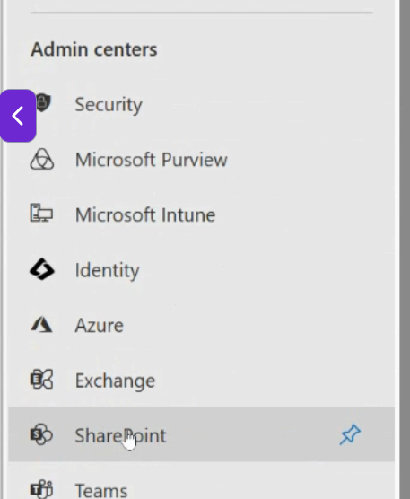
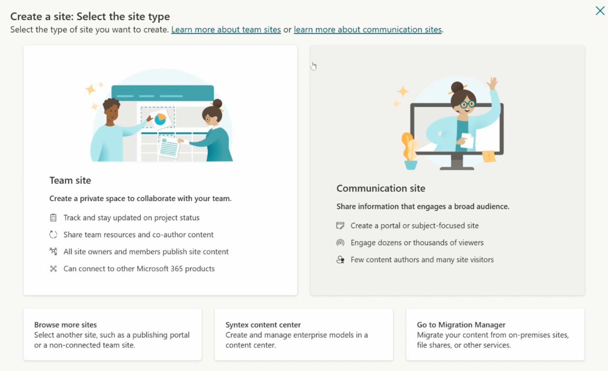

<h1>Microsoft 365</h1>

- [1. Core objects of M365 Services](#1-core-objects-of-m365-services)
  - [1.1 Licence types affect access to M365](#11-licence-types-affect-access-to-m365)
  - [1.2 Organisation Configurations](#12-organisation-configurations)
  - [1.3 Exchange Online Objects](#13-exchange-online-objects)
    - [1.3.1 Exchange 365 Groups](#131-exchange-365-groups)
    - [1.3.2 Exchange Distribution List](#132-exchange-distribution-list)
    - [1.3.3 Exchange Email Enabled Security](#133-exchange-email-enabled-security)
    - [1.3.4 Exchange Recipents Contacts](#134-exchange-recipents-contacts)
  - [1.4 Sharepoint Administration Objects](#14-sharepoint-administration-objects)
    - [1.4.1 Roles and Permissions involving Sharepoint sites](#141-roles-and-permissions-involving-sharepoint-sites)
  - [1.5 Microsoft Teams Administration](#15-microsoft-teams-administration)
- [2. Understanding M365 Security Principles](#2-understanding-m365-security-principles)
  - [2.1 Zero Trust Principles](#21-zero-trust-principles)
  - [2.2 Microsoft Entra ID Authentication](#22-microsoft-entra-id-authentication)
    - [2.2.1 What is Entra ID Authentication](#221-what-is-entra-id-authentication)
    - [2.2.2 Certificate Based Authentication (CBA)](#222-certificate-based-authentication-cba)
    - [2.2.3 Temporary Access Pass (TAP)](#223-temporary-access-pass-tap)
    - [2.2.4 OAuth 2.0 Access Tokens](#224-oauth-20-access-tokens)
    - [2.2.5 Microsoft Authenticator](#225-microsoft-authenticator)
    - [2.2.6 FIDO2 (Fast IDentity Online 2) / Passkeys](#226-fido2-fast-identity-online-2--passkeys)
- [2.3 Where to configure Authentication Methods](#23-where-to-configure-authentication-methods)
- [2.4 Creating Users](#24-creating-users)
  - [2.4.1 Create Internal Users](#241-create-internal-users)
- [2.5 Understanding Threat Protection and Threat Intelligence](#25-understanding-threat-protection-and-threat-intelligence)
  - [2.5.1 Threat Protection](#251-threat-protection)
  - [2.5.2 M365 Threat Protection Stack](#252-m365-threat-protection-stack)
  - [2.5.3 Threat Intelligence](#253-threat-intelligence)
- [3.1 Core Security Features of M365 services](#31-core-security-features-of-m365-services)
  - [3.1.1 Conditional Access](#311-conditional-access)
  - [3.1.2 Signal Examples](#312-signal-examples)
  - [3.1.3 Single Sign On (SSO)](#313-single-sign-on-sso)
  - [3.1.4 Multi Factor Authentication (MFA)](#314-multi-factor-authentication-mfa)
    - [3.1.4.1 what Licenses Do you need for MFA](#3141-what-licenses-do-you-need-for-mfa)
  - [3.1.5 Role Based Access Control (RBAC)](#315-role-based-access-control-rbac)
    - [3.1.5.1 Azure RBAC Roles](#3151-azure-rbac-roles)
    - [3.1.5.2 Microsoft 365 \& Entra ID Roles](#3152-microsoft-365--entra-id-roles)

## 1. Core objects of M365 Services

### 1.1 Licence types affect access to M365

- M365 licenses are going to control what services a user can access
- Features that you can access depends on licenses that you have purchased
- You will have to purchase and assign a license to a user before they can do anything
  - Would reccomend to assign licenses to groups instead of users
  - In the event of internal transfer, the user will change his license accordingly

> Note: If a user belongs to 2 groups, it might consume the licenses of both groups. 
> 
> Even if for example one group has E5 and the other is E3. Although the E5 covers all of E3, it will still consume 2 licenses.

### 1.2 Organisation Configurations

- Access it via M365 Admin center > settings > Org Settings

    

- We can setup a Domain Name for the subscription by going to the Domain section under settings
- But for the domain name to be recognized, we need to first buy the domain name from a domain name provider like GoDaddy.
    - You can also buy the domain name directly in this page

    
    

- You can also buy domain name from other companys but you will have to manually add them yourself by using the "Add Domain" button

    

### 1.3 Exchange Online Objects

- Any users that have an exchange online license can have a mailbox created for them

- To manage email for users we have to access the Exchange Admin center which is accessible via the left menu from M365 Admin center
  - You might need to click "Show All" for it to appear

  

#### 1.3.1 Exchange 365 Groups

- Access via Exchange Admin Center > Recipents > Groups

- When a group is created, it will also create the following:
  - Email address for the group
    - Any email sent to this address, all users in groups will recieve it
    - Not to be confused with shared mailbox
    - Shared mailbox creates a mailbox container to store mails that was sent to them and allows the group members to drag and drop the emails from the mailbox to their personnel email.
    - Emails that are sent to groups email address appear in the group folder in each user Outlook.

  - SharePoint linked to the group
  - Teams linked to the group
  - Shared Calendar

#### 1.3.2 Exchange Distribution List

- Just a group that have an email address and nothing else
- Sending to that email address will automatically send to all users in the group
- Mainly for applications to send status of the server (error notifications) to inform a particular group or for announcements that can span over a wide range of users
- There are 2 different types of Distribution List
  

- For Static, you will have to add the users in manually.
- For Dynamic, you can set some conditions for it to be added automatically
    

    > When users belong to a department called support, it will automatically be added to this distribution list.

    - Dynamic do not stores the group members in a static location / list, it evaluate the rules instead.
    
#### 1.3.3 Exchange Email Enabled Security

- This group gets an email address and it can gives permission
- Basically it is a security group that can receive emails.

#### 1.3.4 Exchange Recipents Contacts

- Allows you to add external users as a contact to show up in the global address list.

### 1.4 Sharepoint Administration Objects

- Sharepoint is Microsoft cloud based platform for creating, storing, organizing and sharing content across organization
  
- Can be access via M365 Admin center > menu on the left > Sharepoint

  

- Engine behind collaboration in M365
- Everytime you create a new M365 group or teams, sharepoint will provide a site where files, lists, pages and other shared resources can live.
- You can also build sites according to your needs

  

#### 1.4.1 Roles and Permissions involving Sharepoint sites

- Sharepoint sites have the following Memberships

  

- Owners
  - Refers to the M365 Group Owners that the site connected to.
  
    >E.g. When the group is created, the Owner of the group is the owner of this site
  
- Site Owners
  - Refers to the SharePoint specific owners.
  - They are only owners of the site and can makes changes only to the site.
  - No additional permissions are given out of the site

- Members
  - Users who belong to the group and automatically have access to the site.

- Site Members
  - To grant access to the sites and not everything the M365 group is offering
  - Something like just allowing users outside of the group to access the site resources like files and folders
  - Site Members have the <b>EDIT</b> permissions

- Site admins
  - Assist the site owners to manage the sites
  - They have elevated capabilities such as configuring the site features and help maintaining the site

- Site Visitors
  - Only have read access to the sites
  
### 1.5 Microsoft Teams Administration

- Can be access via M365 Admin center > menu on the left > Teams

  

- When you create a new M365 Group, the system will automatically create a Team for you

- The new Team will show up in the Teams app

  

- You can add Channels in the team to show difference chats
  
  

 

## 2. Understanding M365 Security Principles
 

### 2.1 Zero Trust Principles

> Main Idea : Do not trust anything, anyone

- Logic is to verify explicity, always authenticate and give authorization based on whoever the user is or the device is.

- Operate on the <b>PRINCIPLE OF LEAST PRIVILEDGE</b>
  - i.e. Gives out the least amount of rights to users that they need to do their job. 
  - Or Gives the least amount of rights to a device for them to do the job role required
    - E.g. No Admin rights for devices that does not need them

- Work off on a JIT (Just In Time) or JEA (Just Enough Access) strategy

- Azure have PIM (Priviledge Identity Management)
  - Allows admin to schedule access for a given period of time to access resources needed

 

### 2.2 Microsoft Entra ID Authentication

- Microsoft Entra ID is the directory services that we use in both M365 and Azire

#### 2.2.1 What is Entra ID Authentication

- Entra ID authentication is the process of verifying a user's identity before granting access to any resources or services

- Identity Provider 
  - Entra ID acts as the trusted identity provider that handles user authentication for M365, Azure and 3rd party apps

- Authorization vs Authentication
  - Autentication : "Who are you?"
  - Authorization : "What are you allowed to do?"

- Primary Authentication Methods
  - Passwords
  - Passwordless methods
    - App authenticator, receive PIN via mobile
  - Smartcards, certs and temp access pass

- Modern protocols
  - Uses Industry standards like OAuth 2.0, OpenID Connect, SAML and WS-Federation to integrate with apps and services

- Multifactor Authentication
  - Combines 2 or more factors:
    - Something you know : e.g. Passwords
    - Something you have : e.g. phone or hardware dongle
    - Something you are  : e.g. fingerprint

- Authentication Strengths
  - Classifies auth methods by security level:
    - Base MFA
    - Passwordless MFA
    - Phishing-resistant MFA

- Token Based Acess:
  - After sign in , Entra issues tokens that allow the user to access apps without signing in repeatedly.

#### 2.2.2 Certificate Based Authentication (CBA)

- Uses X.509 client certificates to authenticate users directly with Entra ID using TLS mutual authentication

- Digital object that can be generated for each individual user

- Utilizes Transport Layer Security 

- How it works :
  - Users select certificate based login
  - Certificate presented during TLS handshake
  - Entra ID validates certificate attributes
    - issuer, subject, revocation
  - User is signed in without needing a password

- Use cases :
  - Smartcard Environments
  - High Security or government sectors
  - Passwordless but phishing resistant scenarios

| Pros                       | Cons                   |
| -------------------------- | ---------------------- |
| Enhanced Security          | Complex Setup          |
| Passwordless login         | Certificate Management |
| Streamlined Authentication | User Training |

#### 2.2.3 Temporary Access Pass (TAP)

- A time limited passwcode used to secure onboarding and credential recovery

- How it works :
  - Admin generates a one time or multi use code
  - Users enters TAP to register strong credentials
  - Once the TAP expires, it cannot be reused

- Use Cases :
  - First time user onboarding
  - Lost or reset devices
  - Emergency recovery when other credentials are unavailable

  | Pros                | Cons             |
  | ------------------- | ---------------- |
  | Secure Onboarding   | Expiration Risk  |
  | Credential recovery | Admin dependency |
  | One time use        | User error       |
  

#### 2.2.4 OAuth 2.0 Access Tokens

- OAuth 2.0 enables secure token based access to applications and APIs using delegated authentication

- How it works :
  - User Authenticates via Entra ID
  - Entra issues access, refresh and ID tokens
  - Tokens are used by applications instead of passwords

- Use Cases :
  - Single sign on to M365, Azure and 3rd party apps
  - Granting API access with delegated permissions
  - Enabling Conditional Access based on token issuance

| Pros                     | Cons                      |
| ------------------------ | ------------------------- |
| Enhanced Security        | Complexity                |
| Delegated Authentication | Token Management          |
| User Experience          | Potential Vulnerabilities |

#### 2.2.5 Microsoft Authenticator

- Authenticator app supports both passwrodless and MFA based sign ins using push notifications and biometrics

- How it works :
  - Entra ID sends a push to the Authenticator app
  - User confirms using biometrics or PIN
  - Entra validates the signed nonce and grants access

- Use Cases:
  - Passwordless sign in for mobile first users
  - Secondary factor in MFA configurations
  - COnvenient and secure login experience

  | Pros                 | Cons                     |
  | -------------------- | ------------------------ |
  | Enhanced security    | Dependence on device     |
  | User friendly        | Potential for app issues |
  | Seamless integration | Privavy concerns |

#### 2.2.6 FIDO2 (Fast IDentity Online 2) / Passkeys

  - FIDO2 enables passwordless sign in using hardware security keys or buit in passkeys backed by public key cryptography

  - How it works :
    - User inserts or touches the key
    - Key signs a unique challenge with a private key
    - Entra verifies the response and grants access

  - Use Cases :
    - Shared devices or frontline workers
    - High security roles
    - Users who require phishing resistant login

  | Pros                     | Cons                      |
  | ------------------------ | ------------------------- |
  | Enhanced security        | Key loss risk             |
  | Passwordless convenience | Key management Complexity |
  | Phishing Resistnace      | Limited device support |

 

## 2.3 Where to configure Authentication Methods

- Under Azure admin portal, click on Security then Manage to access the Authentication methods

- Under authentication methods, you can see the various types of authentication methods that are available for users

## 2.4 Creating Users
### 2.4.1 Create Internal Users

- There are a couple of ways to create users in Azure

- The most common way is :
  - On Premise AD
  - Azure Entra ID 
  - M365 Admin center

- The difference between them is

| Feature                                                | Microsoft 365 Admin Center | Microsoft Entra Admin Center (Azure)     | On-premises Active Directory                                                                                       |
| ------------------------------------------------------ | -------------------------- | ---------------------------------------- | ------------------------------------------------------------------------------------------------------------------ |
| Where the account is stored                            | Microsoft Entra ID         | Microsoft Entra ID                       | Active Directory Domain Services (AD DS)                                                                           |
| Source of authority                                    | Cloud                      | Cloud                                    | On-premises AD                                                                                                     |
| Best for                                               | Microsoft 365 users        | Identity and access management           | Hybrid organizations using local AD                                                                                |
| Can assign Microsoft 365 licenses during creation?     | Yes                        | Yes (or after creation)                  | No                                                                                                                 |
| Creates Exchange mailbox automatically (with license)? | Yes                        | Yes, once a suitable license is assigned | No; mailbox is created after the synced user receives a license in the cloud (or via Exchange in hybrid scenarios) |
| Requires synchronization?                              | No                         | No                                       | Yes, if users need to access Microsoft 365 using the same identity                                                 |
| Password managed in                                    | Cloud                      | Cloud                                    | On-premises AD (unless cloud password features are configured)                                                     |

## 2.5 Understanding Threat Protection and Threat Intelligence

### 2.5.1 Threat Protection

- Refers to Microsoft tools and services that detect, block and respond to cyber threats targeting users, devices, identities, email and cloud apps

- Goal of Threat Protection is to prevent attacks, detect suspicious activity and automate response actions before damage occurs

### 2.5.2 M365 Threat Protection Stack

- Microsoft Defender XDR 
  - Unified portal for threat detection, investigation and response across endpoints, email, identities and apps

- Microsoft Defender for Endpoint
  - Protect devices with antivirtus, EDR, attack surface reduction and vulnerability management

- Microsoft Defender for Office 365
  - Protects email and collaboration tools from phishing, malware and malicious links

- Microsoft Defender for Identity
  - Analyzes identity based threats using signals from domain controllers

- Microsoft Defender for Cloud Apps (formaerly MCSA)
  - Monitors clooud app usage, detect risky behavior and enforces controls

- All of the above are fed into Defender XDR for unified visibility

### 2.5.3 Threat Intelligence

- Threat Intelligence provides real time awareness of emerging cyber threats

- Helps organizations understand attacker tactics, malware families, phishing campaigns and indicators of compromise (IOCs)

- Microsoft collects intelligence from trillions of signals from all its platforms and global threat sensors.

- Threat intel includes
  - IOCs (Malicious IPs, URLs, file hashes)
  - IOAs (behaviors that indicate an attack technique)
  - Threat actor profiles
  - Attack campaigns and patterns

  > These indicators drive automated protection across Defender products

- Automated Investigation & Response (AIR)
  - Microsoft Defender can automatically
    - Isolate devices
    - Quarantine malicious emails
    - Block harmful URLs
    - Disable compromised accounts
  
  - These reduces the workload on security administrators

- Proactive Security Tools
  - Secure Score
    - Provides recommendations to strengthen the organization security posture
  - Attack Simulation Training
    - Creates phishing simulations to educate users and reduce human risk
  - Vulnerability Management
    - Identifies misconfigurations and weak points before attackers exploit them

- Threat Analytics Dashboards
  - Provide insigts into major global threats and whether the organization is impacted
  - Explain how the attack works and steps to mitigate risk

## 3.1 Core Security Features of M365 services

### 3.1.1 Conditional Access

- Conditional Access is a tool in Azure that brings signals together for access decision making

- Signals help in decision making on whether to allow access or enforce certain policies

  

- Conditional Access takes signals from various sources into account when making access decisions

  

### 3.1.2 Signal Examples

- User or group membership
  - Policies can be targeted to specific users and groups giving administrators fine grained control over access

- IP Location information
  - Organizations can create trusted IP address ranges that can be used when making policy decisions

  - Administrators can specify entire countries/regions IP ranges to block or allow traffic from

- Device
  - Users with devices of specific platforms or marked with a specific state can be used when enforcing Conditional Access Policies

  - Use filters for devices to target policies to specific devices like privileged access workstations

- Applications
  - Users attempting to access specific applications can trigger different Conditional Access policies

- Real time and calculated risk detection
  - Signals integration with Microsoft Entra ID Protection allows Conditional Access policies to identify and remediate risky users and sign in behavior

- Microsoft Defender for Cloud Apps
  - Enables user application access and sessions to be monitored and controlled in real time.

  - This integration increases visibility and control over access to and activities done within you cloud environment

### 3.1.3 Single Sign On (SSO)

- SSO allows a user to sign in once and access multiple apps and services without having to reenter their password

- Managed through identity providers like Microsoft Entra ID, which issues and validates the sign in token

- Works across M365, Azure apps, SaaS apps and on premise apps integrated through SSO

- Purpose of SSO

    - Simplify aythentication for users by eliminating repeated sign ins

    - Centralize identity management in one place (Entra ID)

    - Improve security by reducing password fatigue and encouraging stronger security controls like MFA

    - Enable seamless productivity across cloud and on prem apps

- Security Benefits
  
  - Reduced password fatigue
    - Users aren't tempted to reuse simple password everywhere

  - Fewer login prompts
    - Lowers risk of phishing

  - Centralized access control
    - Admins can block access instantly by disabling the user account

  - Strong authentication enforcement
    - MFA, Conditional Access and passwordless sign ins apply consistently across all apps

- Operational Benefits

  - Better user experience
    - One login give access to multiple apps and services

  - Fewer helpdesk calls related to password resets or login troubles

  - Fast onboarding / offboarding
    - Access is automatically granted or removed based on Entra ID
  
  - Consistent policies across all connected apps

  

- How SSO Works at a High Level

  1. User authenticates once with Entra ID
  2. Entra ID issues a token that proves the user's identity
  3. Apps trust Entra ID so no additional password is required
  4. When token expires, Entra can silently reissue a new one without user interaction

### 3.1.4 Multi Factor Authentication (MFA)

- MFA requires 2 or more verification factors to access a account

- Factors include:
  - Something you know (password)
  - Something you have (Phone, Security Key)
  - Something you are (Biometrics)

- Reduces the risk of unauthorized access even if a password is compromised

- MFA is critical because :
  - Over 99% of identity based attacks can be blocked with MFA
  - Common threats it mitigates
    - Phishing
      - Tricking users into revealing credentials through fake websites or emails

      - Password Spraying
        - Trying common passwords across manay accounts

      - Credential Stuffing
        - Using stolen username / password pairs from other breaches

  - Required for compliance (e.g. GDPR, HIPAA, NIST)

#### 3.1.4.1 what Licenses Do you need for MFA

| Feature                   | License Required                        | Notes                                                                                |
| ------------------------- | --------------------------------------- | ------------------------------------------------------------------------------------ |
| Security Default          | Free                                    | Tenant wide enforcement with limited customization.   Authenticator app requried. |
| Conditional Access MFA    | Entra ID P1 (or inlcuded in M365 E3/E5) | Enables targeted MFA enforcement using conditions like user risk, location or app    |
| Risk based / Adaptive MFA | Entra ID P2 (or included in M365 E5)    | Uses real time risk detection to challenge users only when necessary |

### 3.1.5 Role Based Access Control (RBAC)

- Roles
  - Define what users can do within Microsoft services
  - Based on the principle of least privilege
  - Used in Azure, M365 amd Entra ID to control access

  

#### 3.1.5.1 Azure RBAC Roles

- Azure RBAC roles are role based access control permissions that manage who can access Azure resources
  - What they can do and what is the scope that they can do
    - Management group
    - Subscription
    - Resource group
    - etc

- Key Role Type
  - Owner
    - Full Access including assigning roles

  - Contributor
    - Create and manage resources
    - Does not include RBAC management

  - Reader
    - View only access to resources

  - Custom
    - User defined specific permissions

- Scope levels :
  - Management Group > Subscription > Resource Group > Resource

#### 3.1.5.2 Microsoft 365 & Entra ID Roles

- Entra ID Roles are predefined sets of permissions that control access to identity and directory resources acroos M365 and Azure environments

  - Common Examples:
    - Global Administrator
      - Full control across Entra ID

    - User Administrator
      - Manage Users and Groups

- Microsoft 365 roles are built in administrative roles that grant users specific permissions to manage services in the MS Office groups of applications.

  - Key Built in Roles
    - Global Admin
      - Full Access

    - Exchange admin
      - Manage milboxes, transport rules

    - Sharepoint Admin
      - Site collections and settings

- Best Practices
  - Assign roles to groups, not individuals
  - Follow least privilege
  - Reguarly review role assignments

