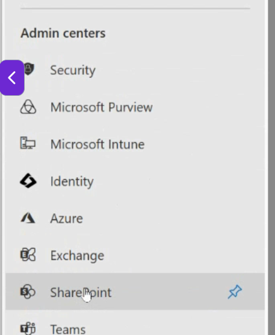
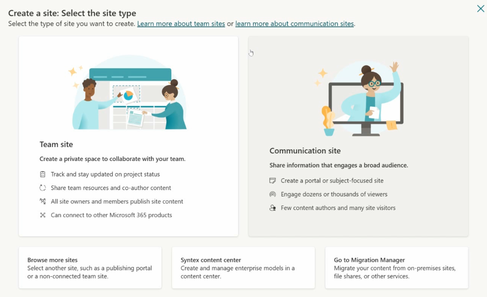

<h1>Microsoft 365</h1>

- [1. Core objects of M365 Services](#1-core-objects-of-m365-services)
  - [1.1 Licence types affect access to M365](#11-licence-types-affect-access-to-m365)
  - [1.2 Organisation Configurations](#12-organisation-configurations)
  - [1.3 Exchange Online Objects](#13-exchange-online-objects)
    - [1.3.1 Exchange 365 Groups](#131-exchange-365-groups)
    - [1.3.2 Exchange Distribution List](#132-exchange-distribution-list)
    - [1.3.3 Exchange Email Enabled Security](#133-exchange-email-enabled-security)
    - [1.3.4 Exchange Recipents Contacts](#134-exchange-recipents-contacts)
  - [1.4 Sharepoint Administration Objects](#14-sharepoint-administration-objects)
    - [1.4.1 Roles and Permissions involving Sharepoint sites](#141-roles-and-permissions-involving-sharepoint-sites)
  - [1.5 Microsoft Teams Administration](#15-microsoft-teams-administration)
- [2. Understanding M365 Security Principles](#2-understanding-m365-security-principles)
  - [2.1 Zero Trust Principles](#21-zero-trust-principles)
  - [2.2 Microsoft Entra ID Authentication](#22-microsoft-entra-id-authentication)
    - [2.2.1 What is Entra ID Authentication](#221-what-is-entra-id-authentication)
    - [2.2.2 Certificate Based Authentication (CBA)](#222-certificate-based-authentication-cba)
    - [2.2.3 Temporary Access Pass (TAP)](#223-temporary-access-pass-tap)
    - [2.2.4 OAuth 2.0 Access Tokens](#224-oauth-20-access-tokens)
    - [2.2.5 Microsoft Authenticator](#225-microsoft-authenticator)
    - [2.2.6 FIDO2 (Fast IDentity Online 2) / Passkeys](#226-fido2-fast-identity-online-2--passkeys)
- [2.3 Where to configure Authentication Methods](#23-where-to-configure-authentication-methods)
- [2.4 Creating Users](#24-creating-users)
  - [2.4.1 Create Internal Users](#241-create-internal-users)
- [2.5 Understanding Threat Protection and Threat Intelligence](#25-understanding-threat-protection-and-threat-intelligence)
  - [2.5.1 Threat Protection](#251-threat-protection)
  - [2.5.2 M365 Threat Protection Stack](#252-m365-threat-protection-stack)
  - [2.5.3 Threat Intelligence](#253-threat-intelligence)
- [3.1 Core Security Features of M365 services](#31-core-security-features-of-m365-services)
  - [3.1.1 Conditional Access](#311-conditional-access)
  - [3.1.2 Signal Examples](#312-signal-examples)
  - [3.1.3 Single Sign On (SSO)](#313-single-sign-on-sso)
  - [3.1.4 Multi Factor Authentication (MFA)](#314-multi-factor-authentication-mfa)
    - [3.1.4.1 what Licenses Do you need for MFA](#3141-what-licenses-do-you-need-for-mfa)
  - [3.1.5 Role Based Access Control (RBAC)](#315-role-based-access-control-rbac)
    - [3.1.5.1 Azure RBAC Roles](#3151-azure-rbac-roles)
    - [3.1.5.2 Microsoft 365 \& Entra ID Roles](#3152-microsoft-365--entra-id-roles)
  - [3.1.6 Role of Privileged Identity Management (PIM)](#316-role-of-privileged-identity-management-pim)
  - [3.1.7 Understanding App Registration and Enterprise Apps](#317-understanding-app-registration-and-enterprise-apps)
- [4. Understanding Microsoft Purview](#4-understanding-microsoft-purview)
  - [4.1 Identifying Sensitive Information](#41-identifying-sensitive-information)
  - [4.2 Data Sensitivity Levels](#42-data-sensitivity-levels)
  - [4.3 Legal and Regulatory Compliance](#43-legal-and-regulatory-compliance)
  - [4.4 Data Governance and Management Policies](#44-data-governance-and-management-policies)
  - [4.5 Assessment and RIs Management](#45-assessment-and-ris-management)
  - [4.6 Tools and Techniques for Identifying Sensitive Data](#46-tools-and-techniques-for-identifying-sensitive-data)
    - [4.6.1 Data Loss Prevention (DLP)](#461-data-loss-prevention-dlp)
    - [4.6.2 Communication Compliance](#462-communication-compliance)
    - [4.6.3 Insider Risk Management](#463-insider-risk-management)
  - [4.7 Microsoft Purview Data Security Posture Managemnt (DSPM) for AI](#47-microsoft-purview-data-security-posture-managemnt-dspm-for-ai)
  - [4.8 Sensitivity Labels](#48-sensitivity-labels)
    - [4.8.1 What Sensitivity Labels can do](#481-what-sensitivity-labels-can-do)
  - [4.9 Retention](#49-retention)
    - [4.9.1 How retention settings work](#491-how-retention-settings-work)
    - [4.9.2 Retention Policy VS Retention Labels](#492-retention-policy-vs-retention-labels)
    - [4.9.3 Retention labels and policies that apply them](#493-retention-labels-and-policies-that-apply-them)
  - [4.10 Disposition Reviews](#410-disposition-reviews)
- [5. Understanding data security implications of Copilot](#5-understanding-data-security-implications-of-copilot)
  - [5.1 What is Microsoft 365 Copilot?](#51-what-is-microsoft-365-copilot)
    - [5.1 How Copilot uses and protects your data](#51-how-copilot-uses-and-protects-your-data)
  - [5.2 Data Storage, Privacy and User Controls](#52-data-storage-privacy-and-user-controls)
  - [5.3 Extensibility and Third Party Data](#53-extensibility-and-third-party-data)
  - [5.4 Safety, Compliance and Responsible AI](#54-safety-compliance-and-responsible-ai)
  - [5.5 How Microsoft Graph Influences Copilot responses](#55-how-microsoft-graph-influences-copilot-responses)
  - [5.6 Understand responsible AI principles](#56-understand-responsible-ai-principles)
    - [5.6.1 Identify](#561-identify)
    - [5.6.2 Measure](#562-measure)
    - [5.6.3 Mitigate](#563-mitigate)
    - [5.6.4 Operate](#564-operate)
- [6. Identify data protection and governance risk for M365 and Copilot](#6-identify-data-protection-and-governance-risk-for-m365-and-copilot)
  - [6.1 Identify compliance risks \& recommendations by using Purview Compliance Manager](#61-identify-compliance-risks--recommendations-by-using-purview-compliance-manager)
  - [6.2 Identify Sensitive Information by using MIcrosoft Purview Data Explorer](#62-identify-sensitive-information-by-using-microsoft-purview-data-explorer)
  - [6.3 Identify Risks by using Insider Risk Management](#63-identify-risks-by-using-insider-risk-management)
    - [6.3.1 Principles of Insider Risk Management](#631-principles-of-insider-risk-management)
    - [6.3.2 Insider Risk Workflow](#632-insider-risk-workflow)
    - [6.3.3 Insider Risk Policies](#633-insider-risk-policies)
    - [6.3.4 Alerts](#634-alerts)
    - [6.3.5 Triage](#635-triage)
    - [6.3.6 Investigate](#636-investigate)
    - [6.3.7 Action](#637-action)
- [7. Identify and monitor oversharing in SharePoint in M365](#7-identify-and-monitor-oversharing-in-sharepoint-in-m365)
- [8. Understand Features and capabilities of Copilot and agents](#8-understand-features-and-capabilities-of-copilot-and-agents)
  - [8.1 Copilot VS AI Agent](#81-copilot-vs-ai-agent)
  - [8.2 Built In Capabilities of Copilot](#82-built-in-capabilities-of-copilot)
  - [8.3 Built In Capabilities of AI Agents](#83-built-in-capabilities-of-ai-agents)
  - [8.4 When to use Copilot](#84-when-to-use-copilot)
  - [8.5 When to use AI Agents](#85-when-to-use-ai-agents)

## 1. Core objects of M365 Services

### 1.1 Licence types affect access to M365

- M365 licenses are going to control what services a user can access
- Features that you can access depends on licenses that you have purchased
- You will have to purchase and assign a license to a user before they can do anything
  - Would reccomend to assign licenses to groups instead of users
  - In the event of internal transfer, the user will change his license accordingly

> Note: If a user belongs to 2 groups, it might consume the licenses of both groups. 
> 
> Even if for example one group has E5 and the other is E3. Although the E5 covers all of E3, it will still consume 2 licenses.

### 1.2 Organisation Configurations

- Access it via M365 Admin center > settings > Org Settings

    

- We can setup a Domain Name for the subscription by going to the Domain section under settings

- But for the domain name to be recognized, we need to first buy the domain name from a domain name provider like GoDaddy.
    - You can also buy the domain name directly in this page

    
    

- You can also buy domain name from other companys but you will have to manually add them yourself by using the "Add Domain" button

    

### 1.3 Exchange Online Objects

- Any users that have an exchange online license can have a mailbox created for them

- To manage email for users we have to access the Exchange Admin center which is accessible via the left menu from M365 Admin center
  - You might need to click "Show All" for it to appear

  

#### 1.3.1 Exchange 365 Groups

- Access via Exchange Admin Center > Recipents > Groups

- When a group is created, it will also create the following:
  - Email address for the group
    - Any email sent to this address, all users in groups will recieve it
    - Not to be confused with shared mailbox
    - Shared mailbox creates a mailbox container to store mails that was sent to them and allows the group members to drag and drop the emails from the mailbox to their personnel email.
    - Emails that are sent to groups email address appear in the group folder in each user Outlook.

  - SharePoint linked to the group
  - Teams linked to the group
  - Shared Calendar

#### 1.3.2 Exchange Distribution List

- Just a group that have an email address and nothing else
- Sending to that email address will automatically send to all users in the group
- Mainly for applications to send status of the server (error notifications) to inform a particular group or for announcements that can span over a wide range of users
- There are 2 different types of Distribution List
  

- For Static, you will have to add the users in manually.
- For Dynamic, you can set some conditions for it to be added automatically
    

    > When users belong to a department called support, it will automatically be added to this distribution list.

    - Dynamic do not stores the group members in a static location / list, it evaluate the rules instead.
    
#### 1.3.3 Exchange Email Enabled Security

- This group gets an email address and it can gives permission
- Basically it is a security group that can receive emails.

#### 1.3.4 Exchange Recipents Contacts

- Allows you to add external users as a contact to show up in the global address list.

### 1.4 Sharepoint Administration Objects

- Sharepoint is Microsoft cloud based platform for creating, storing, organizing and sharing content across organization
  
- Can be access via M365 Admin center > menu on the left > Sharepoint

  

- Engine behind collaboration in M365
- Everytime you create a new M365 group or teams, sharepoint will provide a site where files, lists, pages and other shared resources can live.
- You can also build sites according to your needs

  

#### 1.4.1 Roles and Permissions involving Sharepoint sites

- Sharepoint sites have the following Memberships

  

- Owners
  - Refers to the M365 Group Owners that the site connected to.
  
    >E.g. When the group is created, the Owner of the group is the owner of this site
  
- Site Owners
  - Refers to the SharePoint specific owners.
  - They are only owners of the site and can makes changes only to the site.
  - No additional permissions are given out of the site

- Members
  - Users who belong to the group and automatically have access to the site.

- Site Members
  - To grant access to the sites and not everything the M365 group is offering
  - Something like just allowing users outside of the group to access the site resources like files and folders
  - Site Members have the <b>EDIT</b> permissions

- Site admins
  - Assist the site owners to manage the sites
  - They have elevated capabilities such as configuring the site features and help maintaining the site

- Site Visitors
  - Only have read access to the sites
  
### 1.5 Microsoft Teams Administration

- Can be access via M365 Admin center > menu on the left > Teams

  

- When you create a new M365 Group, the system will automatically create a Team for you

- The new Team will show up in the Teams app

  

- You can add Channels in the team to show difference chats
  
  

 

## 2. Understanding M365 Security Principles
 

### 2.1 Zero Trust Principles

> Main Idea : Do not trust anything, anyone

- Logic is to verify explicity, always authenticate and give authorization based on whoever the user is or the device is.

- Operate on the <b>PRINCIPLE OF LEAST PRIVILEDGE</b>
  - i.e. Gives out the least amount of rights to users that they need to do their job. 
  - Or Gives the least amount of rights to a device for them to do the job role required
    - E.g. No Admin rights for devices that does not need them

- Work off on a JIT (Just In Time) or JEA (Just Enough Access) strategy

- Azure have PIM (Priviledge Identity Management)
  - Allows admin to schedule access for a given period of time to access resources needed

 

### 2.2 Microsoft Entra ID Authentication

- Microsoft Entra ID is the directory services that we use in both M365 and Azire

#### 2.2.1 What is Entra ID Authentication

- Entra ID authentication is the process of verifying a user's identity before granting access to any resources or services

- Identity Provider 
  - Entra ID acts as the trusted identity provider that handles user authentication for M365, Azure and 3rd party apps

- Authorization vs Authentication
  - Autentication : "Who are you?"
  - Authorization : "What are you allowed to do?"

- Primary Authentication Methods
  - Passwords
  - Passwordless methods
    - App authenticator, receive PIN via mobile
  - Smartcards, certs and temp access pass

- Modern protocols
  - Uses Industry standards like OAuth 2.0, OpenID Connect, SAML and WS-Federation to integrate with apps and services

- Multifactor Authentication
  - Combines 2 or more factors:
    - Something you know : e.g. Passwords
    - Something you have : e.g. phone or hardware dongle
    - Something you are  : e.g. fingerprint

- Authentication Strengths
  - Classifies auth methods by security level:
    - Base MFA
    - Passwordless MFA
    - Phishing-resistant MFA

- Token Based Acess:
  - After sign in , Entra issues tokens that allow the user to access apps without signing in repeatedly.

#### 2.2.2 Certificate Based Authentication (CBA)

- Uses X.509 client certificates to authenticate users directly with Entra ID using TLS mutual authentication

- Digital object that can be generated for each individual user

- Utilizes Transport Layer Security 

- How it works :
  - Users select certificate based login
  - Certificate presented during TLS handshake
  - Entra ID validates certificate attributes
    - issuer, subject, revocation
  - User is signed in without needing a password

- Use cases :
  - Smartcard Environments
  - High Security or government sectors
  - Passwordless but phishing resistant scenarios

| Pros                       | Cons                   |
| -------------------------- | ---------------------- |
| Enhanced Security          | Complex Setup          |
| Passwordless login         | Certificate Management |
| Streamlined Authentication | User Training |

#### 2.2.3 Temporary Access Pass (TAP)

- A time limited passwcode used to secure onboarding and credential recovery

- How it works :
  - Admin generates a one time or multi use code
  - Users enters TAP to register strong credentials
  - Once the TAP expires, it cannot be reused

- Use Cases :
  - First time user onboarding
  - Lost or reset devices
  - Emergency recovery when other credentials are unavailable

  | Pros                | Cons             |
  | ------------------- | ---------------- |
  | Secure Onboarding   | Expiration Risk  |
  | Credential recovery | Admin dependency |
  | One time use        | User error       |
  

#### 2.2.4 OAuth 2.0 Access Tokens

- OAuth 2.0 enables secure token based access to applications and APIs using delegated authentication

- How it works :
  - User Authenticates via Entra ID
  - Entra issues access, refresh and ID tokens
  - Tokens are used by applications instead of passwords

- Use Cases :
  - Single sign on to M365, Azure and 3rd party apps
  - Granting API access with delegated permissions
  - Enabling Conditional Access based on token issuance

| Pros                     | Cons                      |
| ------------------------ | ------------------------- |
| Enhanced Security        | Complexity                |
| Delegated Authentication | Token Management          |
| User Experience          | Potential Vulnerabilities |

#### 2.2.5 Microsoft Authenticator

- Authenticator app supports both passwrodless and MFA based sign ins using push notifications and biometrics

- How it works :
  - Entra ID sends a push to the Authenticator app
  - User confirms using biometrics or PIN
  - Entra validates the signed nonce and grants access

- Use Cases:
  - Passwordless sign in for mobile first users
  - Secondary factor in MFA configurations
  - COnvenient and secure login experience

  | Pros                 | Cons                     |
  | -------------------- | ------------------------ |
  | Enhanced security    | Dependence on device     |
  | User friendly        | Potential for app issues |
  | Seamless integration | Privavy concerns |

#### 2.2.6 FIDO2 (Fast IDentity Online 2) / Passkeys

  - FIDO2 enables passwordless sign in using hardware security keys or buit in passkeys backed by public key cryptography

  - How it works :
    - User inserts or touches the key
    - Key signs a unique challenge with a private key
    - Entra verifies the response and grants access

  - Use Cases :
    - Shared devices or frontline workers
    - High security roles
    - Users who require phishing resistant login

  | Pros                     | Cons                      |
  | ------------------------ | ------------------------- |
  | Enhanced security        | Key loss risk             |
  | Passwordless convenience | Key management Complexity |
  | Phishing Resistnace      | Limited device support |

 

## 2.3 Where to configure Authentication Methods

- Under Azure admin portal, click on Security then Manage to access the Authentication methods

- Under authentication methods, you can see the various types of authentication methods that are available for users

## 2.4 Creating Users
### 2.4.1 Create Internal Users

- There are a couple of ways to create users in Azure

- The most common way is :
  - On Premise AD
  - Azure Entra ID 
  - M365 Admin center

- The difference between them is

| Feature                                                | Microsoft 365 Admin Center | Microsoft Entra Admin Center (Azure)     | On-premises Active Directory                                                                                       |
| ------------------------------------------------------ | -------------------------- | ---------------------------------------- | ------------------------------------------------------------------------------------------------------------------ |
| Where the account is stored                            | Microsoft Entra ID         | Microsoft Entra ID                       | Active Directory Domain Services (AD DS)                                                                           |
| Source of authority                                    | Cloud                      | Cloud                                    | On-premises AD                                                                                                     |
| Best for                                               | Microsoft 365 users        | Identity and access management           | Hybrid organizations using local AD                                                                                |
| Can assign Microsoft 365 licenses during creation?     | Yes                        | Yes (or after creation)                  | No                                                                                                                 |
| Creates Exchange mailbox automatically (with license)? | Yes                        | Yes, once a suitable license is assigned | No; mailbox is created after the synced user receives a license in the cloud (or via Exchange in hybrid scenarios) |
| Requires synchronization?                              | No                         | No                                       | Yes, if users need to access Microsoft 365 using the same identity                                                 |
| Password managed in                                    | Cloud                      | Cloud                                    | On-premises AD (unless cloud password features are configured)                                                     |

## 2.5 Understanding Threat Protection and Threat Intelligence

### 2.5.1 Threat Protection

- Refers to Microsoft tools and services that detect, block and respond to cyber threats targeting users, devices, identities, email and cloud apps

- Goal of Threat Protection is to prevent attacks, detect suspicious activity and automate response actions before damage occurs

### 2.5.2 M365 Threat Protection Stack

- Microsoft Defender XDR 
  - Unified portal for threat detection, investigation and response across endpoints, email, identities and apps

- Microsoft Defender for Endpoint
  - Protect devices with antivirtus, EDR, attack surface reduction and vulnerability management

- Microsoft Defender for Office 365
  - Protects email and collaboration tools from phishing, malware and malicious links

- Microsoft Defender for Identity
  - Analyzes identity based threats using signals from domain controllers

- Microsoft Defender for Cloud Apps (formaerly MCSA)
  - Monitors clooud app usage, detect risky behavior and enforces controls

- All of the above are fed into Defender XDR for unified visibility

### 2.5.3 Threat Intelligence

- Threat Intelligence provides real time awareness of emerging cyber threats

- Helps organizations understand attacker tactics, malware families, phishing campaigns and indicators of compromise (IOCs)

- Microsoft collects intelligence from trillions of signals from all its platforms and global threat sensors.

- Threat intel includes
  - IOCs (Malicious IPs, URLs, file hashes)
  - IOAs (behaviors that indicate an attack technique)
  - Threat actor profiles
  - Attack campaigns and patterns

  > These indicators drive automated protection across Defender products

- Automated Investigation & Response (AIR)
  - Microsoft Defender can automatically
    - Isolate devices
    - Quarantine malicious emails
    - Block harmful URLs
    - Disable compromised accounts
  
  - These reduces the workload on security administrators

- Proactive Security Tools
  - Secure Score
    - Provides recommendations to strengthen the organization security posture
  - Attack Simulation Training
    - Creates phishing simulations to educate users and reduce human risk
  - Vulnerability Management
    - Identifies misconfigurations and weak points before attackers exploit them

- Threat Analytics Dashboards
  - Provide insigts into major global threats and whether the organization is impacted
  - Explain how the attack works and steps to mitigate risk

## 3.1 Core Security Features of M365 services

### 3.1.1 Conditional Access

- Conditional Access is a tool in Azure that brings signals together for access decision making

- Signals help in decision making on whether to allow access or enforce certain policies

  

- Conditional Access takes signals from various sources into account when making access decisions

  

### 3.1.2 Signal Examples

- User or group membership
  - Policies can be targeted to specific users and groups giving administrators fine grained control over access

- IP Location information
  - Organizations can create trusted IP address ranges that can be used when making policy decisions

  - Administrators can specify entire countries/regions IP ranges to block or allow traffic from

- Device
  - Users with devices of specific platforms or marked with a specific state can be used when enforcing Conditional Access Policies

  - Use filters for devices to target policies to specific devices like privileged access workstations

- Applications
  - Users attempting to access specific applications can trigger different Conditional Access policies

- Real time and calculated risk detection
  - Signals integration with Microsoft Entra ID Protection allows Conditional Access policies to identify and remediate risky users and sign in behavior

- Microsoft Defender for Cloud Apps
  - Enables user application access and sessions to be monitored and controlled in real time.

  - This integration increases visibility and control over access to and activities done within you cloud environment

### 3.1.3 Single Sign On (SSO)

- SSO allows a user to sign in once and access multiple apps and services without having to reenter their password

- Managed through identity providers like Microsoft Entra ID, which issues and validates the sign in token

- Works across M365, Azure apps, SaaS apps and on premise apps integrated through SSO

- Purpose of SSO

    - Simplify aythentication for users by eliminating repeated sign ins

    - Centralize identity management in one place (Entra ID)

    - Improve security by reducing password fatigue and encouraging stronger security controls like MFA

    - Enable seamless productivity across cloud and on prem apps

- Security Benefits
  
  - Reduced password fatigue
    - Users aren't tempted to reuse simple password everywhere

  - Fewer login prompts
    - Lowers risk of phishing

  - Centralized access control
    - Admins can block access instantly by disabling the user account

  - Strong authentication enforcement
    - MFA, Conditional Access and passwordless sign ins apply consistently across all apps

- Operational Benefits

  - Better user experience
    - One login give access to multiple apps and services

  - Fewer helpdesk calls related to password resets or login troubles

  - Fast onboarding / offboarding
    - Access is automatically granted or removed based on Entra ID
  
  - Consistent policies across all connected apps

  

- How SSO Works at a High Level

  1. User authenticates once with Entra ID
  2. Entra ID issues a token that proves the user's identity
  3. Apps trust Entra ID so no additional password is required
  4. When token expires, Entra can silently reissue a new one without user interaction

### 3.1.4 Multi Factor Authentication (MFA)

- MFA requires 2 or more verification factors to access a account

- Factors include:
  - Something you know (password)
  - Something you have (Phone, Security Key)
  - Something you are (Biometrics)

- Reduces the risk of unauthorized access even if a password is compromised

- MFA is critical because :
  - Over 99% of identity based attacks can be blocked with MFA
  - Common threats it mitigates
    - Phishing
      - Tricking users into revealing credentials through fake websites or emails

      - Password Spraying
        - Trying common passwords across manay accounts

      - Credential Stuffing
        - Using stolen username / password pairs from other breaches

  - Required for compliance (e.g. GDPR, HIPAA, NIST)

#### 3.1.4.1 what Licenses Do you need for MFA

| Feature                   | License Required                        | Notes                                                                                |
| ------------------------- | --------------------------------------- | ------------------------------------------------------------------------------------ |
| Security Default          | Free                                    | Tenant wide enforcement with limited customization.   Authenticator app requried. |
| Conditional Access MFA    | Entra ID P1 (or inlcuded in M365 E3/E5) | Enables targeted MFA enforcement using conditions like user risk, location or app    |
| Risk based / Adaptive MFA | Entra ID P2 (or included in M365 E5)    | Uses real time risk detection to challenge users only when necessary |

### 3.1.5 Role Based Access Control (RBAC)

- Roles
  - Define what users can do within Microsoft services
  - Based on the principle of least privilege
  - Used in Azure, M365 amd Entra ID to control access

  

#### 3.1.5.1 Azure RBAC Roles

- Azure RBAC roles are role based access control permissions that manage who can access Azure resources
  - What they can do and what is the scope that they can do
    - Management group
    - Subscription
    - Resource group
    - etc

- Key Role Type
  - Owner
    - Full Access including assigning roles

  - Contributor
    - Create and manage resources
    - Does not include RBAC management

  - Reader
    - View only access to resources

  - Custom
    - User defined specific permissions

- Scope levels :
  - Management Group > Subscription > Resource Group > Resource

#### 3.1.5.2 Microsoft 365 & Entra ID Roles

- Entra ID Roles are predefined sets of permissions that control access to identity and directory resources acroos M365 and Azure environments

  - Common Examples:
    - Global Administrator
      - Full control across Entra ID

    - User Administrator
      - Manage Users and Groups

- Microsoft 365 roles are built in administrative roles that grant users specific permissions to manage services in the MS Office groups of applications.

  - Key Built in Roles
    - Global Admin
      - Full Access

    - Exchange admin
      - Manage milboxes, transport rules

    - Sharepoint Admin
      - Site collections and settings

- Best Practices
  - Assign roles to groups, not individuals
  - Follow least privilege
  - Reguarly review role assignments

### 3.1.6 Role of Privileged Identity Management (PIM)

- PIM is a technology that allows you to manage, control and monitor access to resources in your organization.

- Simple example: PIM is equalivant to a temp pass for <b>a period of time</b> to access resources in organization

- License that you will need to have PIM
  - Microsoft Entra ID P2
  - Microsoft ENtra ID Governance
  - Other licenses that include the scope of either the one above

- Key Features of PIM
  - Setup just in time privileged access to Entra ID and Azure reources
  - Create time nound access to resources using start and end dates
  - Enforce approval to activate privileged roles
  - Enforce multi-factor authentication to activate a role
  - Utlilize justification to understand why users activate
  - Receive notifications when privileged roles are activated
  - Conduct access reviews to ensure users still need roles
  - Download audit history for internal or external audit

- Roles required for managing PIM
  - Only user who have Privileged role Administratot or Global administrator can manage assignements for other administrators

### 3.1.7 Understanding App Registration and Enterprise Apps

- App Registration
  - How you register the app to Entra ID so that it can use its identiy and authentication services for logging into the app.

 

## 4. Understanding Microsoft Purview

- Purview control center
  - https://purview.microsoft.com

### 4.1 Identifying Sensitive Information

- Types of Sensitive Information
  
  - Personal Identifiable Information (PII)
    - Names, Addresses, Phone numbers etc...

  - Financial Data
    - Credit card numbers, bank account details etc...

  - Health Information
    - Health records, insurance policies

  - Intellectual Property
    - Trade secrets, proprietary business information
    - Software Source code, business data

  - Classified Government Data
    - Sensitive data that must be protected according to government regulations

  - Confidential Business Information
    - Corporate strategies, business operations

### 4.2 Data Sensitivity Levels

- Public 
  - Can be freely shared with the public

- Internal
  - Intended for internal use only
  - Access should be limited to employees within the organization

- Confidential
  - Requires protection from unauthorized access

- High Condifidential / Restricted
  - Data that, if disclosed, could cause significant harm to the organization

### 4.3 Legal and Regulatory Compliance

- Each country has its own Compliance that it need to adhere so search the internet for it.

### 4.4 Data Governance and Management Policies

- Data Classification Policies
  - Defining how data is classified and who has access to each classification level

- Retention Policies
  - Defining how long different types of data should be kept and when they should be deleted

- Incident Response Plan
  - A policy to respond to incidents of data breaches or leaks of sensitive information

### 4.5 Assessment and RIs Management

- Risk Assessments
  - Regularly performing risk assessments to identify vulnerabilities related to sensitive data

- Threat Modeling
  - Identifying potential threats to sensitive data and implementing security measures to mitigate these risks

### 4.6 Tools and Techniques for Identifying Sensitive Data

- Data Classification
  - Labeling data based on its level of sensitivity

- Data Loss Prevention
  - Technologies that help detect, monitor and protect sensitive information from being leaked or accessed by unauthorized individuals

- Encryption
  - Use of encryption to protect sensitive data both at rest and in transit

- Access Control
  - Settng strict permissions and monitoring access to sensitive data

#### 4.6.1 Data Loss Prevention (DLP)

- What DLP does:
  - DLP identifies and monitors sensitive information like :
    - Credit card
    - Identification numbers

  - across objects like :
    - Emails in Exchange
    - Files and folders in SharePoint or OneDrive
    - Chat and files in Teams
    - Devices onboarded using endpoint DLP

- Design Use Cases for DLP
  - Regulatory Compliance Use Cases

    - Prevent exposure of Credit Card Numbers

    - Safeguard Identification Numbers

  - Internal Corporate Policy Cases

    - Prevent accidental Sharing of financial reports

    - Restrict upload of sensitive data to personal cloud storage

  - Geographic or Business Units Use Cases

    - Block sensitive data sharing from region to region

    - Apply stricter policies to HR and Legal departments
      - Ensure only authorized users can access and share contracts or employee records

  - Device and Endpoint Use Cases
    
    - Block copying of sensitive files to USB drives
    
    - Prevent printing of condifential content

    - Detect Screen capture attempts

  - Communication Oversight Use Cases

    - Stop external sharing of NDA protected content

    - Alert users before sending sensitive data

  - Custom or Industry Specific Use cases

    - Protect schematics or CAD files
     
    - Detect interal leaks of source code

#### 4.6.2 Communication Compliance

- Purpose is to detect and manage policy violations in communications applications

  - E.g. Teams, Email etc...

- Use Cases
  
  - Harassment and Bullying Detection
  - Offensive Language or Discrimination
  - Sharing of Confidential or Sensitive Info
  - Regulatory Compliance Monitoring
  - Externaal Communications Monitoring
  - Inappropriate Images or Files

  

#### 4.6.3 Insider Risk Management

- Purpose Detect and mitigate risky user behavior based on activity signals across M365 and endpoints

- Use Cases

  - Data Theft During Offboarding
  - Unusual File Sharing or Uploads
  - Policy Violations
    - Alert when users send sensitive content to personal email or non compliant locations
  - Security Incident Follow up
    - Monitor a user after being involved in a previous security violation
  - Physical Security Breach Indicators
  - Intellectual Property Protection

  

### 4.7 Microsoft Purview Data Security Posture Managemnt (DSPM) for AI

- DSPM is a security solution that's designed tto help organization with accessing, managing and locking down their data to improve security posture

  - First is data discovery
    - Identifying sensitive data and content across storage, resources and service applications
  
  - Second is data risk assessments
    - Assess risk
    - Look for vulnerabilities
    - Making sure encryption is enabled
    - Correct permissions is allocated

  - Thrid is compliance and governance
    - Assist in maintaining compliance with industry regulations
    - Helps visibility and monitoring 

  - Last is policy enforcement
    - Ensure policies are being applied
    - Ensure policies are being maintained and potected

- Microsoft Documentation Link
  - Https://Learn.microsoft.com/en-us/security/security-for-ai/protect

  

### 4.8 Sensitivity Labels

- Sensitivity Labels helps organizations identify and label sensitive information

- Using rules and conditions, information can be automatically labeled and classifications can be applied

- Users can also manually apply sensitivity labels to their documents or emails

  

#### 4.8.1 What Sensitivity Labels can do

- Sensitivity Labels can be configured to 

  - Encrypt emails and documents to prevent unauthorized people from accessing this data

  - Mark the content by adding watermarks to documents , headers or footers to emails that have the label applied

### 4.9 Retention

- Purpose of Retention

  - Enables organizations to proactively adhere to both industry standards and internal guidelines mandating the retention of certain information for set durations

  - Diminish the risk associated with legal disputes or security incidents by allowing for permanenct removal of outdated content that is no longer necessaary to retain

  - Assists organizaations in fostering efficient knowledge sharing and enhancing agility by ensuring employees have access to only the most current and pertinent information

- Retention Actions include :
  - Retain only
    - Retain content forever for a specific period of time

  - Delete only
    - Permanently delete content after a specified period of time

  - Retain and delete 
    - Retain content for a specified period of time and then permanently delete it

#### 4.9.1 How retention settings work

- Content with retention settings generally stays at its initial place

- Any modification or removal of content that are governed by the retention policy, the system automatically preserves a copy

  - In SharePoint and OneDrive, preserved copy is kept in Preservation Hold library

  - Within Exchange mailboxes, stored in Recoverable Items folder

  - Content from teams and interactions using Copilot for M365, copy is kept in a concealed folder name <b>SubstrateHolds</b>, located within the Excahneg Recoverable Items folder as a subfolder.

#### 4.9.2 Retention Policy VS Retention Labels

- Use Retention Policy when you want to set uniform retention parameters for all content within a specific site or mailbox

  - E.g. Maintaining all documents on a SharePoint Site for X years, use Retention Policy

- Use Retention Label when you need to dictate retention settings for particular items such as folders, documents or emails.

  - E.g. SharePoint site resources have different retention period like folder A need X years, folder B need Y years.
  - Retention labels will be better for this.

#### 4.9.3 Retention labels and policies that apply them

- When you publish retention labels, they're included in a retention label policy.

  - A single retention label can be included in multiple retention label policies

  - Retention labe policies specify the locations to publish the retention labels

    

### 4.10 Disposition Reviews

- When content reaches end of its retention period, User might want to review that content and confirm if it can be permanently deleted

  - Instead of deleting the content, we can 
    
    - Suspend the deletion of relevant content for litigation or an audit

    - Assign a different retention period to the content

    - Move the content from tis existing location to archive

## 5. Understanding data security implications of Copilot

### 5.1 What is Microsoft 365 Copilot?

 - An AI assistant built into M365 apps

 - Uses Large Language Models (LLMs) connected to your organization data

 - Retrieves context through Microsoft Graph

 - Generates responses based only on information users already have permission to access

 - Runs within Microsoft's secure M365 environment 
    - <b>Not using public OpenAI services</b>

#### 5.1 How Copilot uses and protects your data

  - Data used includes prompts, retrieved content and Copilot reponses
  
  - No customer data is used to train foundation LLMs
    - Your data is <b>not fed</b> to microsoft AI LLMs for training

  - All interactions stay within M365 service boundary

  - Content is encrypted at rest and in transit and respects exisitng M365 permissions

  - Copilot only shows data you personally have access to (Identity based access control)

  

### 5.2 Data Storage, Privacy and User Controls

- Copilot stores prompts and responses as a user's Copilot activity history

- Admins can search, manage and apply retention via Microsoft Purview

- Users can delete their Copilot activity history from My Account

- Copilot respects sensitivity labels and encrypted content via Purview Information Protection.

### 5.3 Extensibility and Third Party Data

- Copiloy can use Third party tools via Microsoft Graph connectors and agent
  - Third party tools like ServiceNow, SalesForce
  - Microsoft graph acts like a bridge between third party system into your M365 environment

- Only agents approved by admins and installed by users can be used

- Agents receive only the data users already have permission to access

- Admin center shows each agent's permissions + privacy terms before enabling

- External data is only included when the user is authorized for it

  

### 5.4 Safety, Compliance and Responsible AI

- Includes content filters for hate, violence, self-harm and secual content
  - Copilot won't generate anything that are in the content filters.

- Blocks workplace related inferences

- Detects protected material and mitigates jailbreak / prompt-injection attacks

- Built on Microsoft's privacy, security and compliance commitments

  

### 5.5 How Microsoft Graph Influences Copilot responses

  

- Microsoft Graph is a Unified API which connects all M365 data and services together

- Allows M365 apps and Copilot to securely access data stored across your M365 environment

- Copilot uses Microsoft Graph instead of approaching each app individually

- Graph is the central gateway to connecting everything in your organization

- Copilot uses graph to gather real time data from your organization
  - Graph ensures that Copilot only have access to the data you have permissions to.

- Copilot will then sends the data gathered to LLM for LLM to generate the final answer
  - LLMs do not have direct access to your data, it only sees what copilot have sent it.

- Because everything goes through Graph, Copilot reponses will be personalized based on the resources you have permission for access.

### 5.6 Understand responsible AI principles

- Several Azure OpenAI models are generative AI types that have capabilities liek content and code creation, summarization and search functions

- There are heightened challenges in responsible AI encompassing issues like harmful content, manipulation, mimicking human behavior, privacy concerns and more.

- Microsoft have broken its consideration into four stages

  - Identify
  - Measure
  - Mitigate
  - Operate

#### 5.6.1 Identify

- Initial phase of Responsible AI lifecycle is to identify potential harms associated with AI systems

- Early Identification enhances mitigation effectiveness, especially when AI services are tailored to specific context

- There are tools that helps with this, like impact assessments, iterative red team testing and stress testing with testers focusing on system vulnerabilities and risks

- Crucial to pinpoint harms relevant to specific models and applications

  - Factors like application context can also influence harm potential.
    - E.g. AI summarizing doctors notes in healthcare results in inaccuracies

  - Collaborative risk prioritization with experts and subseqquent red teaming help refine focumented list of harms, which can be continually updated based on evolving insights

#### 5.6.2 Measure

- Subsequent phase after identifying prioritized harms, methodical approach for measuring each harm and evaluating the AI system is crucial

- Both manual and automated measurements are benficial

  - Manual allows for focused progress chgecks on priority issues
  - Automated facilitates broad scale evaluations and continuous monitoring for regressions

- To Meansure potential harms, it is advised to manually produce inputs that might trigger the identified harms then evaluate these outputs using clearly deifned metrics

- Metrics should account for the frequency and severity of any harmful output
  
- Measurement stage concludes with a clear harm benchmarking system and documented results which is refined continuously as the system evolves

#### 5.6.3 Mitigate

- Addressing harms posed by LLMs necessitates a cyclical, multi layered strategy that involves both testing and ongoing measurement

- Crafting of a mitigation strategy is advised that integrates four layers of countermeasures for harms pinpointed in the preliminary phases. 

  

#### 5.6.4 Operate

- Essential to define and execute a deployment and operational readiness strategy

- Entails undergoing system reviews with stakeholders, establishing feedback collection mechanisms and formulating incident response and rollback plans

- Key recommendations include 

  - Collaborating with organizational compliance teams to understand required reviews.
    - E.g. Legal, privacy security teams

  - Adopting a phased delivery to manage risk

  - Creating plans for rapid incident response and system rollbacks

  - Taking prompt action against unforeseen harms and blocking misusers

  - establishing effective user feedback channel and harnessing telemetry data  

- Crucial to be aware of potential legal implications in your jurisdiction and to consult legal experts when in doubt
  
## 6. Identify data protection and governance risk for M365 and Copilot

### 6.1 Identify compliance risks & recommendations by using Purview Compliance Manager

- URL for purview :
- https://purview.mircosoft.com

- Compliance manager
- Built in tool to help organization measure, track and improve its compliance posture

- Goal is to show your risk and help guide to fixing them

- Key Improvement actions

- Actions not taken as listed, represents potential attacks from attackers or auditors to take advantage

> Actions that have "Failed High Risk" in test status should be look at immediately and resolve if possible

### 6.2 Identify Sensitive Information by using MIcrosoft Purview Data Explorer

  

- Data Explorer 
  - Tells user about information that has been labeled as classified, sensitive 

- Activity Explorer
  - Checks the activities that users have performed

### 6.3 Identify Risks by using Insider Risk Management

- Insider Risk Management is a compliance solution that helps minimize internal risks by enabling you to detect, investigate and act on malicious activities in your organization

- Insider risk policies allow you to define the types of risk to detect and identify in your organiation 

- Risk analysts in your organiation can quickly take appropriate actions when they are detected
  
- Common Internal Risk
  - Leaks of sensitive data and data spillage
  - Confidentiality violations
  - Intellectual property (IP) theft
  - Fraud
  - Insider trading
  - Regulatory compliance violations

#### 6.3.1 Principles of Insider Risk Management

- Transparency
  - Balance user privacy versus organiation risk with privacy by design architecture

- Configurable
  - Configurable policies based on industry geoggraphical and business groups

- Integrated
  - Integrated workflow across Microsoft Purview solutions

- Actionable
  - Provides insights to enable reviewer notifications, data investigations and user investigations

#### 6.3.2 Insider Risk Workflow

- Insider risk management workflow helps to identify, investigate and take cation to address internal risks

  

#### 6.3.3 Insider Risk Policies

- Insider Risk Policies are created using pre-defined templates and policy conditions.

- These conditions include 
  - How risk indicators are used for alerts
  - Who should the policy inform
  - Which services are prioritized 
  - Detection time period

#### 6.3.4 Alerts

- Alerts are automatically generated by risk indicators that match policy conditions

- Alerts Dashboard enables a quick view of all alerts

#### 6.3.5 Triage

- Triage means assessing the issue can decide what we should do next.

- Activities that need investigation automatically generate alerts 

- Alerts are resolved either by opening a new case, assigning the alert to existing case or dismissing the alert.

#### 6.3.6 Investigate

- Selecting the case for investigation and review

- Primary investigation tools are:
  - User activity 
    - User risk activity is automatically displayed in an interactive chart that plots activities over time

  - Content Explorer 
    - All data files and email messages associated with alert activities are automatically captured and displayed in the Content Explorer

  - Case Notes
    - Reviewers can provide notes for a case in Case Notes sections.

#### 6.3.7 Action

- In cases where serious actions are needed, we can share information to other teams via
  - eDiscovery (Premium) 
    - Provides an end to end workflow to preserve, collect, review, analyze and export content for investigations

    - Allows legal teams to manage the entire legal hold notification workflow

  - Office 365 API integration (preview) 
    - Insider Risk management supports exporting alert information to security information and event management (SIEM) services via O365 Management APIs.

## 7. Identify and monitor oversharing in SharePoint in M365

- To access SharePoint admin center, you can go to http://admin.microsoft.com and click on the SharePoint menu option on the left

  

- You can manage the Sharing settings by clicking on "Policies" > "Sharing"

  

- You can also manage Share settings of each particular sites

  

> When Site and Policy settings are in conflict, the most restrictive setting will take effect.

## 8. Understand Features and capabilities of Copilot and agents

### 8.1 Copilot VS AI Agent

- What is Copilot
  - An AI powered assistant you interact with directly
  - Reactive nature that responds to your prompts and stays user controlled
  - Supports you during task but does not run full autonomous workflows
  - Something like an interface you collaborate with
  - Provides assistance but does not fully automatte processes
    - Something like your personal assistant

- What is AI Agent
  - Specialized or autonomous AI tool built to perform tasks or workflows
  - Can act with minimal human input once configured
  - Proactive nature that can take action, plan steps or run process independently
  - Functions like a "worker" inside your systems
  - Can monitor data, take action and update systems
  - Ideal for repetitive, rule based, large volume or task that needs consistency / automation 
    - Something like if there is an error in system, run a script to check and create ticket.

> Think of agents as apps/tools while Copilot is the interface

### 8.2 Built In Capabilities of Copilot

- Generates contentt
  - Drafts, summaries, emails, reports

- Provides reasoning and insights base on data

- Enchances productivity by accelerating everyday task

- Always keeps the user in control of final decisions and actions

  

### 8.3 Built In Capabilities of AI Agents

- Run Complete workflows end to end
  - Data Retrieval > Analysis > Actions

- Automate processes like ticketing, scheduling, notifications and updates

- Make decisions using defined rules, goals and environmental inputs

- Interact with systems, APIs, databases and enterprise apps

- Adapt and improve over time using feedback and historical data

  

### 8.4 When to use Copilot

- Use Copilot when :
  - You want AI assistance not automation
  - Task requires human judgment or contextual decision making
  - Need creative help, brainstorming or analysis
  - Want real time responses while you work
  - Workflow changes frequently and needs human oversight

### 8.5 When to use AI Agents

- Use AI agents When :
  - Task are repetitive, structured or high volume
  - Need hands off automation across systems
  - Want to reduce manual workload and improve efficiency
  - Processes must run consistently and accurately at scale
  - Need a digital worker that can monitor, act and optimize