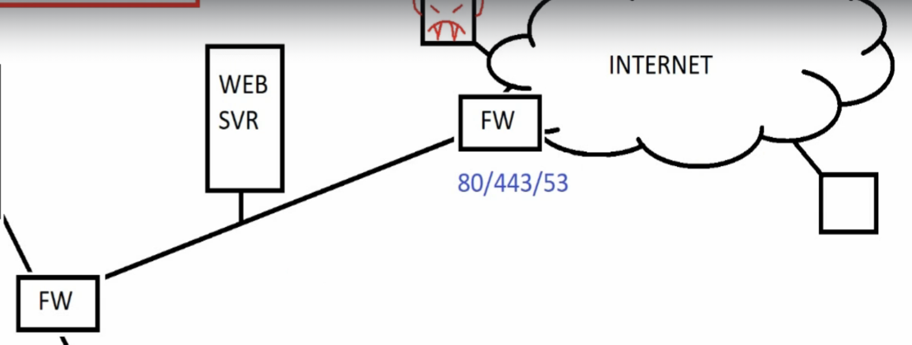
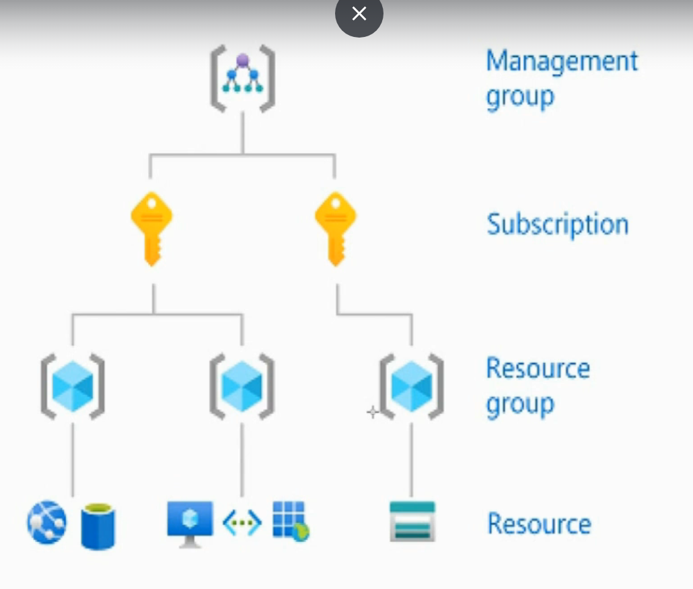
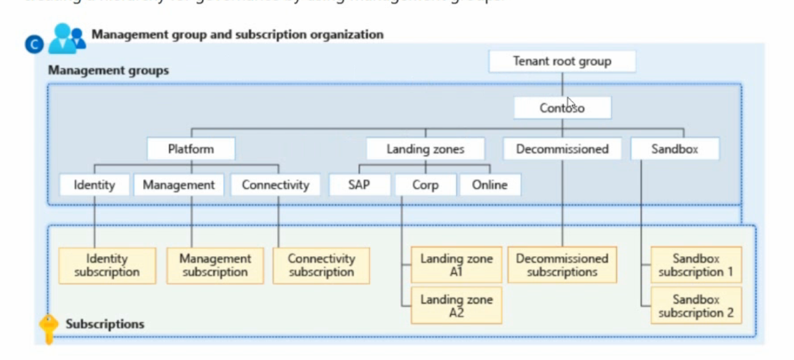
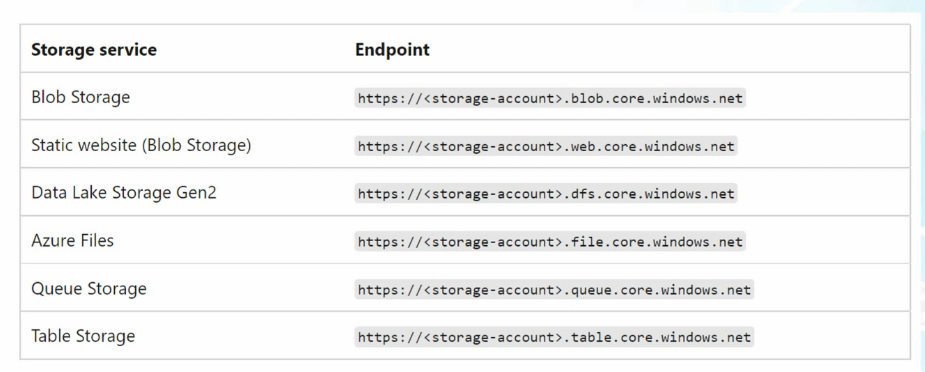
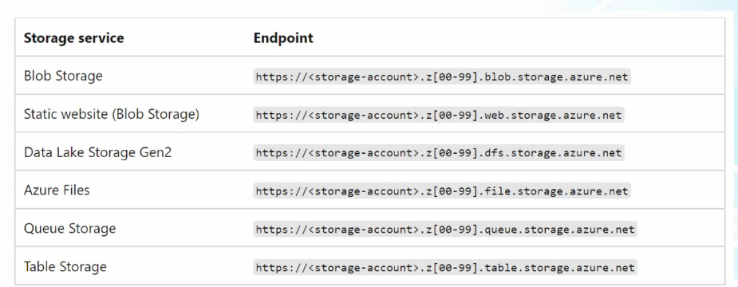
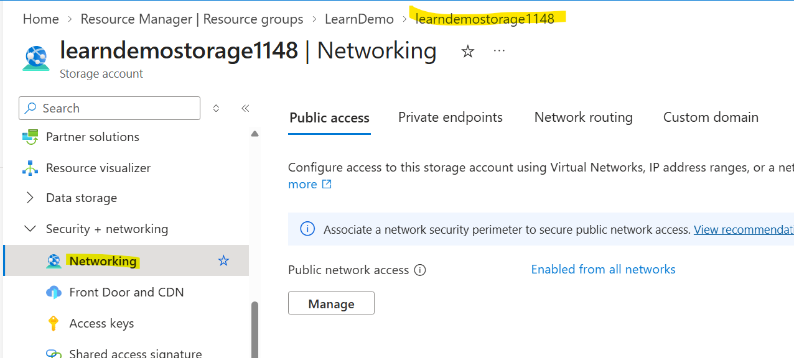
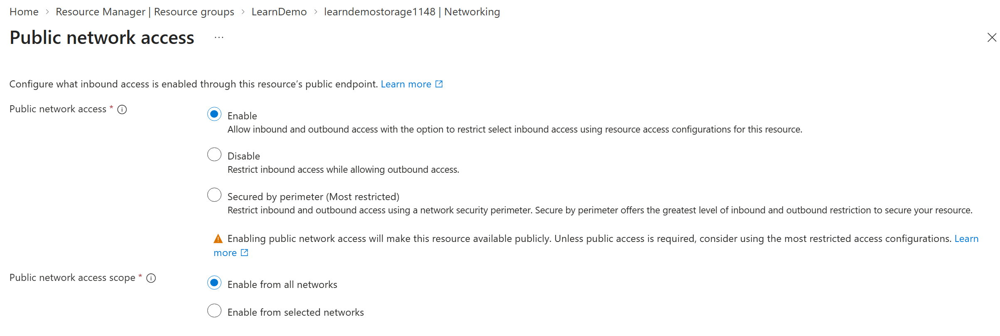
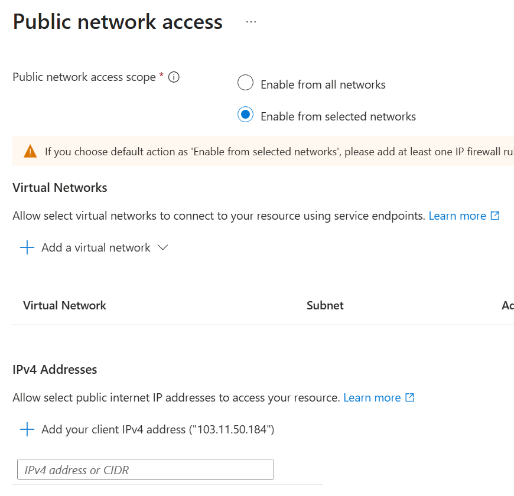
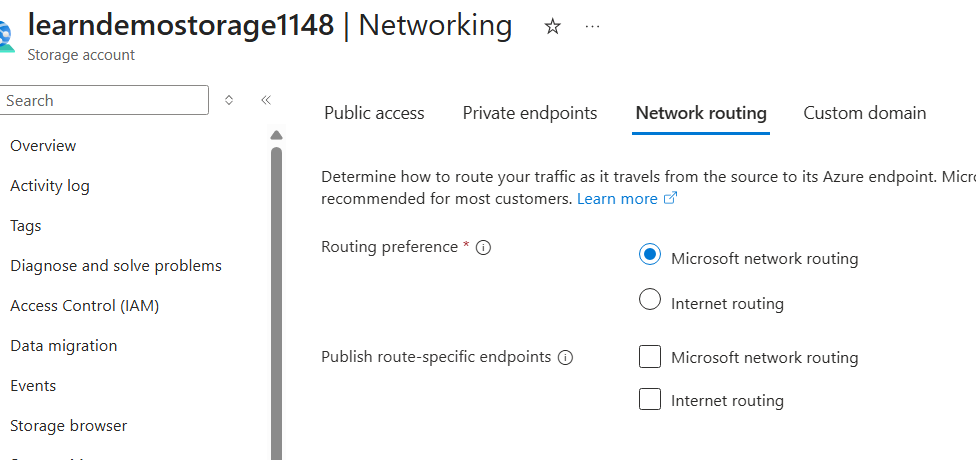

# 1. Foundation of Active Directory Domains

## 1.1 Domain Controller, Active Directory and Domain Name Service
- Domain Controller
  - Active Directory uses the database in the domain controller
  - Replicate between each other if redundancy is setup (2 or more DC are setup)
  - Authentication protocol : Kerberos, NTLM(Legacy)
  - Uses the Directory Service Language called LDAP (Lightweight Directory Access Protocol)

- Active Directory
  - All machines in the AD have to have a name and name must be associated with an IP address

- Domain Name Service (DNS)
  - DNS is the name of the domain you are using
  - Server that associate names and IP addresses
  - All machines in the domain will need to register themselves to DNS
    - Allows the centralization of Name Resolution
    - Meaning they register the IP addresses to DNS and anytime any other machine needs to find another machine, they can query the DNS for the address.

- For syncing of Entra ID with on-premises AD, we use a program called Entra Connect for syncing
  - It will only be a one way sync from on-premise AD to Entra ID

## 1.2 RAS (Remote Access Service)

- Server supports VPN connection by allowing encypted VPN tunnels to be created

## 1.3 DMZ (Demilitarized Zone) or Perimeter

- Zone between 2 firewalls which one of them faces outwards towards the WWW and the other faces inwards to the domain.

- Used mainly for applications that are open to the public 
- The first firewall which faces outwards towards the WWW will allow traffic only to the applications.
- The second firewall will prevent any users to access domain resources.
  - Only the application is allowed to access resources if needed.

## 1.4 IaaS, Infrastructure as a Service

- A service that provides infrastructure for a fee.
  - E.g. Instead of hosting web server at home, we can host the web server in Azure at a price per month.

- Some services offered for example:
  - VMs, Virtual Machines
  - vNETs, Virtual Networks
  - vStorage, Virtual Storages
  - Many Others

## 1.5 SaaS, Software as a Service

- A fully functional application / software ready for user usage.

## 1.6 PaaS, Platform as a Service

- Ready platform for admins to use but admins have to administer it.
- Platforms where admins need to go in to add users and set settings to make things work.
  - E.g. Entra ID where you need to add user permissions to access resources
  - E.g. Printer Server Webpage where you need to configure settings and add users so that they can print

 

# 2. Manage Microsoft Entra Users and Groups

## 2.1 Microsoft Entra Identities

- Multiple ways to manage Identities
  - Azure Portal
  - Microsoft 365 Admin Center
  - Entra Portal
  - On-Premise AD with account sync using Azure AD Connect
  - Powershell and Azure CLI

## 2.2 User Identities

- Human Users who access Microsoft services

- Member users :
  - Employees created directly in Entra ID or Active Directory

- Guest Users :
  - External users invited through B2B collaboration
  - Identity is managed but granted limited access

## 2.3 Service Principles

- Represent application or services that need to authenticate and access resources
- Automatically created when an app is registered in Entra ID
- Used for assigning permissions, running automation or secure access without human interaction
  - E.g. Web app needs to read/write to Microsoft Graph or SQL 

- Main advantage is :
  - Application Authentication  : Ensures secure access for applications and services
  - Automated permissions       : Facilitates permission assignments without human intervention
  - Secure Access               : Provides secure resource access without human interaction

## 2.4 Managed Identities

- Special identities for Azure resources like VMs or Function Apps to access other Azure services securely
  > <b>Without Storing Credentials</b>

 

- There are 2 types
  - System assigned
    - Tied to one resource and lifecycle matches the resource

  - User assigned
    - Standalone identity resuseable across multiple reources
    - E.g. Azure VM accessing a storage account using system assigned identity

## 2.5. Difference between Service Principles and Managed Identities

- Service Principles are either created by user or registered by apps
  - Admins will managed the accounts like passwords and certificates
  - Can be used for logging on and authenticating with Azure 
  - Cen be used for external or 3rd party services

- Managed Identities have no need to manage any secrets or credentials
  - Only work within Azure, not for 3rd party services

## 2.6 Device Identities

- Every Device that is joined to Entra ID gets an identity
- It is used for :
  - Conditional Access
  - Intune Management
  - Device Compliance

- Device can be joined by:
  - Entra ID joined   : Devices directly joined to Entra ID
  - Hybrid AD joined  : Devices are joined to on premises Active Directory
  - Entra ID registred: Devices are registered for BYOD

## 2.7 Groups in Entra ID

- Microsoft 365 Groups
  - Comprehensive suite for enhanced team productivity
  - Collaboration Ready which includes a shared mailbox, calender, SharePoint site, OneNote and Planner
  - Used as backbone for Microsoft Teams, enabling chat, meetings and file sharing
  - Supports Guest Access as external users can be added securely for collaboration
  - Membership can be assigned manually or dynamically based of user attributes by using dynamic rules
  - <b> This group cannot contain Device Identities </b>

- Distribution Groups
  - Used to send email messages to multiple recipents at once
      -  <b>There are no shared workspace or collaboration tools</b>
  - Membership can be static or dynamic
  - Primarily intended for internal announcements or department wide emails
  - Cannot be used to assign permissions to resources like SharePoint or Teams.
  - <b> Group has an email address and any mail sent to that email will be distributed to all the members of the Group </b>

- Mail Enabled Security Group
  - Has a group email address which can also be given permissions to resources
  - Used for both email distribution and assigning permissions to Microsoft 365 resrouces
  - Has a shared email address, allowing group members to receive messages like a distribution list
  - Can be used to manage access to SharePoint, OneDrive, Intune and other resources
  - <b>Has no collaboration Features</b>

- Security Group
  - Primarily used to assign permissions to resources like SharePoint sites, apps and Intune Policies
  - <b> Cannot send or receive email </b>
  - Can include users, devices and service principals for flexible management
  - Membership can be managed manually or through dynamic rules based on Entra ID attributes

### 2.7.1 Assigned vs Dynamic Groups
- Assigned Groups
  - Members are manually added or removed by an admin
- Dynamic Groups
  - Membership is based on rules
    - E.g. Department = "IT"
  - Users/Devices automatically added or removed as attribute change

 

# 3. Managing Azure using command line tools

## 3.1 Microsoft Graph

- A unified API endpoint for M365 and Azure Services
- Lets you access data from Entra ID, Teams, Outlook and more
- Works through a single endpoint
  > https://graph.microsoft.com
- Supports modern aythentication (OAuth 2.0)
- Enables automation, reporting and app intergration across services

## 3.2 Why Microsoft moved to Graph

- Unified access model reduces complexity
- Works across Windows, macOS and Linux
- Supports token based auth and conditional access
- Supports modern developer tools and automation
- Enables scalable, performant data access

## 3.3 Microsoft Graph PowerShell Advantages

- Singale module called <b>Microsoft.Graph</b> for many services
- No need for remote sessions
- More efficient and scalable for bulk operations 
- Continuously updated with new M365 features

## 3.4 Connecting to Graph using Powershell

- You will need to open an Administrator Powershell to install all the cmdlets.
- Use the cmd below to check your execution policy status
  > Get-ExecutionPolicy

- You need the execution policy to be set to either <b>Unrestricted or Bypass</b> to allow scripts to run on the machine.
  > Set-ExecutionPolicy -ExecutionPolicy Bypass

- To install Microsoft Graph into the machine
  > Install-Module Microsoft.Graph -Scope CurrentUser -Repository PSGallery -force

  - Install-Module Microsoft.Graph
    - Install the Module call Microsoft.Graphe

  - -Scope CurrentUser
    - Install the Module for the current user not all users

  - -Repository PSGallery
    - Find the repository called PSGallery and install from there

  - -force
    - Install the module and do not display any prompts

- You might also need to install Nougat if there is a prompt for it

### 3.4.1 To connect to Microsoft Graph

  - Command to connect :
  > Connect-MgGraph -Scopes "Organization.Read.All","Group.ReadWrite.All","User.ReadWrite.All" -TenantId "< TenantID >"

  - The above command only allows access to users and groups, so to have access to other things go to this URL to check out 
  > https://learn.microsoft.com/en-us/graph/permissions-reference

# 4. Manage Access to Azure resources

## 4.1 Understanding Roles

- Roles
  - Roles define what users can do within Microsoft Services
  - Roles are assigned based on the principle of least privilege
  - Central to RBAC (Role Based Access Control)
  - Used in Azure, M365 and Entra ID to control access
  > E.g. User with User administrator role can reset passwords but not delete subscriptions

## 4.2 Azure RBAC Roles

- RBAC roles are role based access control permissions that manage :
  - who can access Azure resources
  - what they can do at what scope

- Scope levels
  - Management Group > Subscription > Resource Group > Resource

  

  E.g.

  

- Key Role Types
  - Owner       : Full access including assigning roles
  - Contributor : Create and manage resources, no role assignment authority
  - Reader      : View only access
  - Custom      : User defined specific permissions

## 4.3 Entra ID Roles

- Entra ID roles are predefined sets of permissions that control access to identity and directory resources across M365 and Azure environments.

- Some common Role Examples:
  - Global Administrator    : Full control across Entra ID
  - User Administrator      : Manage users and groups
  - Security Administrator  : View or manage security settings

## 4.4 Microsoft 365 Roles

- M365 roles are built in administrative roles that grant users specific permissions to manage services like Exchange, SharePoint, Teams and compliance features with M365 exosystem.

- Key built in Roles
  - Global Admin      : Full access
  - Exchange Admin    : Manage mailboxes, transport rules
  - SharePoint Admin  : Site collections and settings
  - Teams Admin       : Manage Teams policies and configuration
  - Compliance Admin  : Access Purview features

## 4.5. Principle of Least Priviledge

- This principle is to give out the least amount of rights but still provides users the ability to do their job
- There is a service called Priviledged Identity Management (PIM) and one part of the service is "Just in Time" (JIT) administration
- With JIT, we can give out access for a time period just to do things that they needed to do for that period.
  - E.g. User administrator is going on a holiday and ask Network administrator to help him with user management during this period. We can just give the Network Administrator the "User administrator" role for the period that he is on holiday.

 

# 5. Understanding Storage Accounts

- Azure storage account provides storage services and a unique namespace for your Azure Storage data that's accessible from HTTP / HTTPS.

- Data in storage account is durable and high available, secure and scalable

- Azure storage account contains all Azure Storage data objects, which includes:
  - blobs
    - Blobs are Binary Large OBjects
    - Can be essentially anything, file, image, video etc...
  - file shares
    - Files and folders that are shared across the network 
    - Like sharing files in a on premise network
  - queues & tables
    - For database uses
  - disks 
    - Virtual disk that you have allocated for a VM or other services

## 5.1 Azure Storage Redundancy Options

| Redundancy Type                   | Meaning                              | Replication Scope         | Use Case                                |
| --------------------------------- | ------------------------------------ | ------------------------- | --------------------------------------- |
| LRS (Locally Redundant Storage)   | 3 copies in 1 datacenter             | Local (1 Region)          | Cost Effective, minimal redundancy      |
| ZRS (Zone Redundant Storage)      | 3 copies across 3 availability zones | Regional (multi-zone)     | High availability within a region       |
| GRS (Geo Redundant Storage)       | LRS + async copy to another region   | Cross Region              | Disaster Recovery                       |
| RA-GRS (Read Access GRS)          | GRS + read access to seconday region | Cross region (readable)   | Apps needing read access during outages |
| GZRS (Geo Zone Redundant Storage) | ZRS + async to another region        | Multi-zone + cross region | Highes availability + DR resilience |

## 5.2 Types of Storage Accounts

| Type                        | Supported storage services                                 | Redundancy options     | Usage                                                                                                                                                                                                                                                |
| --------------------------- | ---------------------------------------------------------- | ---------------------- | ---------------------------------------------------------------------------------------------------------------------------------------------------------------------------------------------------------------------------------------------------- |
| Stamdard general purpose v2 | Blob Storage, Queue Storage, Table Storage and Azure Files | All Redundancy options | Standard storage account type for blobs , file shares, queues and tables. Recommended for most scenarios using Azure Storage.   Premium files shares account type is needed for support for NFS files in Azure Files                           |
| Premium block blobs         | Blob Storage (includes Data Lake Storage)                  | LRS / ZRS              | Premium storage account type for block blobs and append blobs. Recommended for scenarios with high transaction rates, use smaller objects or require consistently low storage latency                                                                |
| Premium file shares         | Azure Files                                                | LRS / ZRS              | Premium storage account type for file shares only. Recommended for enterprise or high performance scale applications.    Use this account type if you want a storage account that supports both Server Message Block (SMB) and NFS file shares |
| Premium page blobs          | Page Blobs only                                            | LRS                    |   Premium storage account type for page blobs only.                                                                                                                                                                                                                                        |

## 5.3 Storage Account Endpoints

- Storage account provides a unique namespace in Azure for your adata
- Every object stored in Azure storage has a URL address that includes the unqiue account name

- There are 2 types of service endpoints available for a storage account:
  - Standard endpoints
    - Can create up to 250 storage accounts per region with standard endpoints in a given subscription
    - Includes the protocol, storage account name as the subdomain and a fixed domain that includes the name of the service

    - E.g. Standard endpoints for each of the Azure Storage services
      

  - Azure DNS zone endpoints
    - Can create up to 5000 storage accounts per region with Azure DNS zone endpoints in a give subscription
    - When Azure DNS zone endpoints is created, Azure Storage dynamically selects an Azure DNS zone and assigns it to the storage account.
    - Azure DNS zone service endpoitn includes the protocol, the storage account name as the subdomain, domain that includes the name of service and identifier for the DNS zone
      - Identifier for the DNS one always begins with z and can range from z00 to z99

    

## 5.4 Networking for Storage Accounts

- Access the networking submenu via clicking on the 
  > Storage account > Security + Networking >

   

  

### 5.4.1 Public network access

  

- For public network access scope, this refers to how much you will exposure this storage account.
  - Enable from all networks 
    - Expose the storage account to the WWW
    - Common use will be for web images or videos that are display in your webpages 
  

  

  - Enable from selected networks
    - Allows you to configure which Virtual Private Networks or Host Devices to access the storage account (trusted sources)
    - Allows resources from Virtual Networks or devices to interact with the storage account

### 5.4.2 Network Routing

  

  - Determines how you would like to route from the source to the destination.
  - Microsoft routing is reccomended and the default setting
    - This is using the Microsoft backend secure routing network to route your traffic

  - Internet routing is using the regular internet path
    - Maybe slower or less secure

