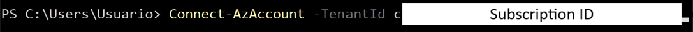

<h2>Azure AZ104 Course</h2>

Url Of Course : https://www.udemy.com/course/70533-azure/?couponCode=KEEPLEARNING

---

- [Overview of Azure Services](#overview-of-azure-services)
  - [Virtual Machines](#virtual-machines)
  - [Abstractions of Virtual Machines](#abstractions-of-virtual-machines)
  - [App Services](#app-services)
  - [Azure Storage](#azure-storage)
  - [Data Services](#data-services)
  - [ Microservices / Serverless ](#-microservices--serverless-)
  - [ Networking ](#-networking-)
- [Powershell and CLI](#powershell-and-cli)
  - [Versions of PowerShell](#versions-of-powershell)
  - [Commands in Azure - Bash / CLI](#commands-in-azure---bash--cli)
  - [Commands in Azure - PowerShell](#commands-in-azure---powershell)
- [Azure Active Directory or Entra ID](#azure-active-directory-or-entra-id)
  - [Basic Concepts of Accounts \& Subscriptions](#basic-concepts-of-accounts--subscriptions)
  - [Managing Users and Groups](#managing-users-and-groups)
    - [Adding user via Dynamic Query](#adding-user-via-dynamic-query)
  - [Managing Licenses in Entra ID](#managing-licenses-in-entra-id)
  - [Administrative Units](#administrative-units)
  - [Managing Devices](#managing-devices)
  - [Bulk Operations](#bulk-operations)
  - [External Users](#external-users)
  - [Self Service Password Reset](#self-service-password-reset)
  - [Azure AD Connect](#azure-ad-connect)
- [Role Based Access Control (RBAC)](#role-based-access-control-rbac)
  - [RBAC Access Keys](#rbac-access-keys)
  - [Three Main Roles in Azure ](#three-main-roles-in-azure-)
  - [Managing Resources with Roles ](#managing-resources-with-roles-)
  - [RBAC IAM Scopes](#rbac-iam-scopes)

# <h3>Overview of Azure Services</h3>

## <h4><u>Virtual Machines</u></h4>

- Infrastructure as a Service (IaaS)
- OS is either Windows or Linux
- Can be remotely connected using SSH or RDP
- Can be configured like a on premise server but it is not.
- Can be placed on virtual networks, arranged in "availibility sets" and workloads can be helped by load balancers
- Can install any software and the server can be created in a few minutes

##  <h4><u>Abstractions of Virtual Machines</u></h4>

- Azure Batch
  - Allows user to run large scale parallel jobs

- Virtual Machine Scale Sets (VMSS)
  - Allows the function to automatically scales VMs in and out
  - Each VMs is considered an independant machine

- Azure Kubernetes Service (AKS)
  - Fully managed Kubernetes environment
  - Contains nodes and orchestrator

- Service Fabric ( Decreasing Use )
  - Platform for building microservices

##  <h4><u>App Services</u></h4>

- Azure App Services is a fully managed platform for running web apps or services without managing the underlying server

-  OS can be either Windows or Linux

- Fully Managed servers, there is no ability to remote control into them

- Supports a wide range of frameworks like:
  - .NET
  - Java
  - Ruby
  - Node.js
  - PHP
  - Python

- Has alot of benefits like:
  - Auto Scaling
  - CI / CD
  - Deployment slots
  - Integrates with Visual Studio
  - and more

##  <h4><u>Azure Storage</u></h4>

- Unmanaged Storage (Normal Storage Account)
  - Can have almost unlimited amount of storage
  
  - Exapndable storage option that is Scalable to Petabytes

  - 4 types of data you can store:
    - Blobs
    - Queues
    - Tables
    - Files

  - Have various levels of replication and redundancy, locally or globally

  - Have 4 storage tiers which have their own corresponding costs to consider

  - Storage tiers are : Hot, Cool, Cold and Archive

- Managed Storage is mainly referring to Virtual Machine Hard Disk

##  <h4><u>Data Services</u></h4>

- This is a way to store data by using databases

- Can be use for relational and non relational databases

- Examples of databases:
  - SQL
    - Azure SQL Database
    - Azure SL Managed Instances
    - SQL Server on a VM

  - NoSQL
    - Cosmos DB

- For Big Data Solutions, Azure offers Synapse Analytics (SQL Data Warehouse)

- PostgreSQL Flexiable Server is a new and upcoming enterprise grade product managed by Microsoft. ( Just for info )

##  <h4><u> Microservices / Serverless </u></h4>

- Microservices is a concept of multiple small applications that can be operated and managed independently, working together to perform a job.

- Microservices in Azure :
  - Azure Container Apps 
  - API Mangement
  - Azure Container Instances
  - Service Fabric

- Serverless / Event Driven services in Azure :
  - Azure Functions
  - Azure Logic Apps

##  <h4><u> Networking </u></h4>

- 4 Major Catergories
  - Connectivity
  - Security
  - Delivery
  - Monitoring

- Connectivity
  - Is about how Azure resources talk to each other or to the internet

  - Example of services :
    - Virtual Networks (VNet)
    - Virtual WAN
    - ExpressRoute
    - VPN Gateway
    - Azure DNS
    - Peering

- Security
  - Protects your network from internal or external threats

  - Example of services :
    - Network Security Groups (NSG)
      - This controls what is going in and out of the subnets

    - Azure Private Links
      - Access services privately

    - DDoS Protection

    - Azure Firewall

    - Web Application Firewall (WAF)

    - Virtual Network Endpoints

    - Bastion
      - Allows secure RDP or SSH access without provisioning a public IP address to your servers

- Delivery
  - Services that helps to deliver what is needed to the end users

  - Example of services :
    - Content Delivery Services (CDN)
      - Can be use as standalone service or part of Azure Front Door

    - Azure Front Door 
      - CDN + Global Load Balancer solution

    - Traffic Manager
        - DNS based routing

    - Application Gateway
        - Layer 7 traffic manager

    - Load Balancer
      - Traffic distribution at layer 4

- Monitoring

  - Key to keep things running

  - Example of services :
    
    - Network Watcher for diagnostics
    - Metrics and Logs for visibililty
    - Packet Capture for deep troubleshooting

# <h3>Powershell and CLI</h3>

## <h3>Versions of PowerShell</h3>
- As of current, the normal PowerShell version in laptops are 5.x

- It is reccomended to download / upgrade to PowerShell 7 as it offers better performance with regards to running of scripts

## <h3>Commands in Azure - Bash / CLI</h3>

- Bash / CLI terminal will start with <b>$</b>

    

- Commands always starts with 
  > az

    Example:
    > az vm list

    > az network vnet list

## <h3>Commands in Azure - PowerShell</h3>

- CLI commands also works in Powershell

- PowerShell terminal will start with PS on the left

    

- For PowerShell we will need to set the session to a subscription ID for it to register which subscription the current session will be running on

    

- Examples of Commands
    > Get-AzVM

    > New-AzVM

- We can also connect directly to Azure using PowerShell by using :
  

# <h2>Azure Active Directory or Entra ID</h2>

Azure Active Directory is sometimes called AAD in short.

It has now been renamed as <b>Azure Entra ID</b>

It is a product to manage user identities on the cloud.

For on premises environment, <b>Active Directory</b> is what we can say the same product for windows server that is providing the same services.

## Basic Concepts of Accounts & Subscriptions

- Account / User

  - A person or a program
    - Person : i.e. John Smith - johnsmith@example.com

  - App Managed Identity
    - Represent program or Service
    - i.e. SystemService

  - It is the basis for authentication

- Tenant
  
  - A representation of an organization
  
  - usually represented by a public domain name
    - i.e. companyname.com

  - Will be assigned a domain if not specified
    - i.e. companyname.onmicrosoft.com

  - A dedicated instance of Azure Active Directory

  - Every Azure Account is part of at least one tenant

  > Every tenant can have muliple subscription

  > More than one account can be the Owner in a tenant

- Subscription

  - An aggreement with Microsoft to use Azure services

  - All Azure resource usage gets billed to the payment method of the subscription

  > Not every tenant needs to have a subscription

  
- Resource Group

## Managing Users and Groups

- Entra ID can create "Groups"

- Groups are used for easier management of users in Entra as organization structure

- Admins can assign permissions to Groups 

- There are 2 Group Types : Security and Microsoft 365

  - Security 
    - Cannot be used for shared email out of the box
    - Grant users access to sharepoint sites and resources
    - Can assign licenses to users in the group

  - Microsoft 365
    - Automatically provisions a shared mailbox, calendar, SharePoint site, and OneDrive notebook.
    -  Can only contain users (including external guests).
    - Excellent for Teams, Planner, and cross-suite collaboration.

### Adding user via Dynamic Query

- You can choose the group to have Dynamic User as Membership type

  

- The query can be scripted at the bottom

  

- Write the script as needed

  

## Managing Licenses in Entra ID

- Licenses can be managed via Entra ID tenant Overview > Licenses on the left sub menu

  

- To view the licenses you have, select "All Products" on the left

  

## Administrative Units

- Can be access via tenant overview left sub menu

  

- Administrative Units is a way to segregate permissions into some type of logical seperation

- i.e. Both HelpDeskAPAC and HelpDesk EU are given the HelpDesk Administrator role.
  - HelpDeskAPAC can only work with office location in APAC
  - HelpDeskEU can only work with users with office location in EU

## Managing Devices

- Entra ID can display which devices are connected to the tenant by accessing Devices in the tenant overview sub menu on the left

  - 

- Devices in Azure represent the physical devices that are accessing Azure resources

  - i.e. Accessing Azure resources using work computer in the office.

- As long as you are authenticating through Azure, be it your personnel computer, phone or tablet, it will be listed as a device in Azure.
    
- Devices can come in Managed or UnManaged forms

  - Managed means you can set some policy compliance like encryption, password requirements etc... for standardization 

    - You can set access to resources that only pass the compliance requirements

## Bulk Operations

- In the event there is a need to mass create user accounts, there is a bulk create option for Admins to fill up

  

- You have to download the csv file <b>TEMPLATE</b>, fill it up with the required data and upload it back for it to work

  

## External Users

- External Users are guest users that belongs to another domain.

- Mainly is for collaboration with other companies or users

- Admin can create external users by inviting them in the New User selection.

  

## Self Service Password Reset

- We can allow users in tenant to reset their password themselves

- Access tenant overview, Password reset on the left sub menu

  
  
  

- None : Does not allow self service password reset

- Selected : Only selected group can do password reset

- All: Everyone can do password reset

## Azure AD Connect

- This is needed when you need to connect to an On Premise AD Controller

- This service helps sync both the Azure and On Premise to ensure users are updated at both ends

- There are other options is to do a password pushback where any password reset due to self service, the on premise AD will update the AD as well.

# <h2>Role Based Access Control (RBAC)</h2>

- A security feature that allows admins to grant access to users, groups or applications the permissions based on their roles in the organization.

- General policy of IT is to get have the "Principle of Least Priviledge"
  
  - i.e. Users should have the smallest amount of permissions that they should have

- RBAC approach is to define "Roles" in the company so admin can assign these "Roles" accordingly

  - Example of "Roles"
    - Developer
    - IT Operations
    - Report Reader

- One user can have multiple roles

- RBAC assign permissions to the role (Not the User)
  - So that all users are treated the same , nobody has secret extra permissions

- It is easier for new joiners to be assigned the correct permissions

## <h3>RBAC Access Keys</h3>

- Storage Accounts can be managed by Access Keys

- It is also known as Claimed Based Access Control (CBAC) 

  

- It can be accessed by anyone as long as they have the Access Keys to the storage accounts.
  
  - Admins can stop internet users from accessing it by turning off the public networking option.

  - After turning off, the storage account can only access via the internal Azure network

- Therefore it is mainly used by web applications that needs it 24x7
  
  - The application does not need an extra User account just to access storage
  
  - It is easier to write inside code the access keys

- To better secure the storage account, we can enable it to be secured by Azure Active Directory instead of keys

  - During storage account creation
    

  - After storage is created
    

## <h3>Three Main Roles in Azure </h3>

- Owner
  - Grants full access to manage all resources, including the ability to assign roles in Azure RBAC

- Contributor
  - Grants full access to manage all resources but does not allow the ability to assign roles in RBAC

- Reader
  - View all resources, but does not allow you to make changes

- There are alot of permissions that are a subset of these 3 main roles.

- These subsets drils down only to a small section to be granted to users

  - E.g. Storage Blob

  

## <h3>Managing Resources with Roles </h3>

- Containers in Storage is like folders in Windows

  

- You can check the container Authentication Method by clicking on the container

  
  > Container have both access key and Azure AD Authentication method 

- Permissions can be set at the continer level

  

## RBAC IAM Scopes

- Take note that there are levels that you can assign Access Control scopes to

  - i.e. Subscription level, resource group and resource level
    

- This is to ensure only the correct users can access that certain resources.

  - i.e. In a bigger organization where it has global presence, APAC users might only have access to resource groups which are for APAC.

  - Or developers only have access to development resource groups

