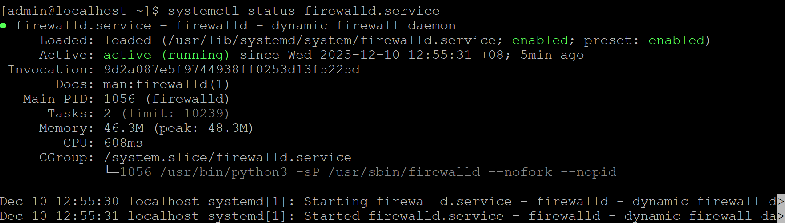

>Services

- Daemons
    - Defined as processes that are created by Services or Applciation and run continuously in the background.

- Most services are daemons
- Services are controlled by command systemctl

- systemd
    - a collection of system management daemons, utilities and libraries
    - systemctl is a systemd utility to for controlling systemd system and service manager
    - Is the parent process of most daemons

&nbsp;

> Below is a table which administrators should know to control services

| Command Name                                            | Description                                           |
| :------------------------------------------------------ | ----------------------------------------------------- |
| systemctl --version                                     | Check is systemd is installed                         |
| ps -ef \|  grep system                                  | Check if systemd is running                           |
| systemctl --all                                         | Check all running services                            |
| systemctl status, start, stop, restart [`service_name`].service | To check the status, start, stop or restart a service |
| systemctl reload [`service_name`].service                       | To reload the configuration file of a service         |
| systemctl enable \| disable [`service_name`].service            | To enable or disable a service at boot time           |
| systemctl mask \| unmask [`service_name`].service               | To enable or disable a service completely             |
|                                                         |                                                       |

