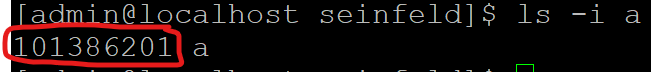
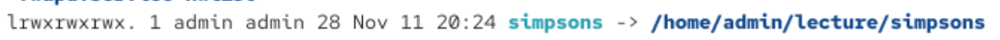

Directory Listing Attributes

Taking `drwxr-xr-x`for example, specfically the table column for <strong>Type</string>:
| Position | Description                                                                            | Remarks                                                                      |
| :------- | -------------------------------------------------------------------------------------- | ---------------------------------------------------------------------------- |
| 1        | `d` indicate this object is a folder   `l` indicate this object is a link <-> `-` indicate object is a file |                                                                              |
| 2 - 4    | `r` refers to read   `w` refers to write   `x` refers to execute   `-`  no permission                | These 3 bits in position 2-4 specify the permissions for `user` of the file |
| 5-7      | `r` refers to read   `w` refers to write   `x` refers to execute    `-`  no permission               | These 3 bits in position 2-4 specify the permissions for `group` of the file |                                                                                 
| 8-10     | `r` refers to read   `w` refers to write   `x` refers to execute   `-`  no permission                | These 3 bits in position 2-4 specify the permissions for `other` of the file |

&nbsp;

>For the rest of the columns:

| Name       | Description                                     |
| :--------- | ----------------------------------------------- |
| # of Links | The number of links attached to directory       |
| Owner      | Who is the owner of the directory / file / link |
| Group      | Which group owns the directory / file/ link     |
| Size       | Size of the file in bytes                       |
| Month      | Month that the file is created                  |
| Day        | Day of the Month that the file is created       |
| Time       | Time of the Day that the file is created        |
| Name       | Name of the file                                |

&nbsp;

>Ways to create Files:

| Name                        | Description                                                                                                                                             |
| :-------------------------- | ------------------------------------------------------------------------------------------------------------------------------------------------------- |
| touch [filename]            | creates an empty file with [filename]                                                                                                                   |
| cp [filename] [destination] | copies a file [filename] to destination                                                                                                                 |
| vi [filename]               | Creates a temp file with [filename] and will automatically enter the vi editor to edit the file    `file is only created when it is saved in editor` |

&nbsp;

>Ways to create directory

    mkdir

&nbsp;

>File and Folder Maintenance Commnds

| Command | Description                                                                                  |
| :------ | -------------------------------------------------------------------------------------------- |
| cp      | Copies a file                                                                                |
| rm      | Removes / Deletes a file                                                                     |
| mv      | Move file from location A to B   OR to `rename` a file from A to B                        |
| mkdir   | Make Directory                                                                               |
| rmdir   | Remove  Directory   Use `rmdir -rf` to remove everything in the directory without prompts |
| chgrp   | Change the group owner of the file / directory                                               |
| chown   | Change the user owner of the file / directory                                                |

&nbsp;

>Soft and Hard Links

- inode is a Pointer or number of a file on the hard disk

- Soft link
    - Link points to the filename, shortcut equilvalent to windows
    

    - Link will need to be deleted if file has change location, deleted or renamed

- Hard Link
    - Deleteing, renaming or moving the original file will not affect the hard link
        - It takes reference to the inode instead of the file location or name

    