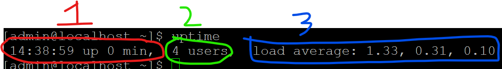

<strong>Processes and Jobs</strong>

> What these terms means

1. Application
    - Sometimes will be referred as Service
    - Programs that runs in the computer

2. Script
    - A file that can be executed in a certain way.

3. Process
    - When application is started, one or more processes are generated, identified by PID (Process ID) automatically given by the system.

4. Daemon
    - A type of process that keeps running in the background until it is interrupted or stopped
    - Examples of Daemon are listeners, where they will keep listening for input or outputs and run the application or processes that are linked to it.

5. Threads
    - A path of execution within a proccess.
    - Every process can have one or more threads associate with it.
    - Each threads have its own (registers, data, context) but shared the same resources (memory, address space, code).

6. Job
    - Created by schedular programs.
    - Runs when the condition stated in the job is fulfilled.

>Monitoring Commands

| Name    | Description                                                                                                         |
| :------ | ------------------------------------------------------------------------------------------------------------------- |
| df -h     | Gives space usage of file systems                                                                          |
| du      | Disk Usage, tells you which file and how much disk is being used by the file                                        |
| uptime  | Tells you how long the system has been online                                                                       |
| top     | Display the details of all the current process, `More to cover later`                                               |
| free    | Shows how much RAM memory is used, cache, buffered and available                                                    |
| lsof    | Shows information like:  - Which files a process has open  - Which ports are open and which process owns them |

-----------------------

<strong>Top Command</strong>

Command to display all the processes that are currently running

| Col Name | Description                                                                                                                                                                 |
| :------- | --------------------------------------------------------------------------------------------------------------------------------------------------------------------------- |
| PID      | Process ID   Unique number for the process for easy reference.  (Can be use by `kill` command to stop the process)                                                    |
| USER     | Owner of the process   Who owns or started the process                                                                                                                   |
| PR       | Process Priority    Each Process can be assigned a priority for CPU to handle   PR are used for REAL TIME scheduler, processes that are mainly initated by processor. |
| NI       | Nice Value of the process   User space priority  that affects how Linux scheduler decides on NORMAL task                                                                 |
| VIRT     | Amount of virtual memory used by the process                                                                                                                                |
| RES      | Amount of resident(Local) memory used by the process                                                                                                                        |
| SHR      | Amount of shared memory used by the process                                                                                                                                 |
| S        | Status of the process    R - Running   S - Sleeping   T - Stopped   Z - Zombie   I - Idle                                                                    |
| %CPU     | CPU time used by the process since last update                                                                                                                              |
| %MEM     | The share of physical memory used                                                                                                                                           |
| TIME+    | Total CPU time used by the task in hundredth of second                                                                                                                      |
| COMMAND  | Command Name or command line                                                                                                                                                |
&nbsp;

> Command : df -h

Argument `-h` prompts the system to output human readable results.

| Name       | Description                                                                          |
| :--------- | ------------------------------------------------------------------------------------ |
| FileSystem | The type of the filesystem, list devices or pseudo filesystems tha thas been mounted |
| Size       | The total size of the filesystem                                                     |
| Used       | How much is used                                                                     |
| Avail      | How much is available                                                                |
| Use%       | The percentage that is used to Size                                                  |
| Mounted on | The folder that it attached to                                                         |

>Command : du

To check how much disk usage each file / processes are using in bytes

use the below to sort according to usage

    du -k | sort -nr

>Command : uptime

Tells you how long the server have been up

1. The time when the server is booted and how many minutes it has been online since then.
2. How many users are connected to the system
3. Load average in % for the past 1, 5 and 15 mins 

&nbsp;

>Command : free

Command to check on memory usage

>Command : lsof

Command to list files that are opened.
Good for troubleshooting files that are hung on open when processes did not exit properly.

>Command : tcpdump

Command to check the packets that are sent and received thru the interface.

>Command : ps -ef

Shows all the currently running process

>Command : kill [PID]

Command to stop the process gracefully

