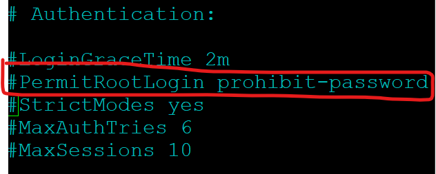

>SSH ( Secure Shell )
- Provides an secure communication interface to the Linux System.
- Takes the commands and translate them to kernel to manage hardware
- It is always encrypted.

> Open SSH
- Installed when during Linux installation
- Service daemon is `sshd`
- Default port for SSH is port `22`
    
----
&nbsp;

> Common configuration to better secure SSH sessions

<strong>Always make a backup copy before you change any config file!!!</strong>

1. Configure Idle TImeout Interval
    - Avoid having an unattended SSH session
    - Can be conifgured by setting an Idle timeout interval
        - Using root account, edit `/etc/ssh/ssh_config` file
        - Comment out by removing the `#` and change the parameter to the following
            - ClientAliveInterval 600
            - ClientAliveCountMax 0

        - Remember to restart the service add changes
            - `systemctl restart ssh`

    - Do take note that there are 2 different files, `ssh_config` & `sshd_config`
        - `ssh_config` is for configuring the host(most likely client) side.
            - For `ClientAliveInterval`, host will send keepalive messages to server every N seconds

        - `sshd_config` is for configuring the server side 
            - For `ClientAliveInterval`, server will send a message to client every N seconds if no data received

2. Disable Root Login
    - Disable any user from using the root account
    - Configured by editing the parameter in `/etc/ssh/sshd_config` using root account.
        - Change `PermisRootLogin` from `Yes` to `No`

         

         - Restart sshd service `systemctl restart sshd`

3. Disable Empty Passwords
    - To prevent remote logins from accounts with empty passwords for added security
    - Configured by editing the parameter in `/etc/ssh/sshd_config` using root account.
        - Remove `#` from `PermitEmptyPasswords`
        - Make sure `PermitEmptyPasswords` is set to `No`
        
        

        - Restart sshd service `systemctl restart sshd`

4. Limit Users' SSH Access
    - Limit SSH access only to authorized users
    - Configure by adding parameter in `/etc/ssh/sshd_config` using root account.
        - Add `AllowUsers [user]`

    

    - Restart sshd service `systemctl restart sshd`

5. Use a different port
    - SSH service default port runs on `22`
    - Hackers will normally look for port `22` for SSH servers
    - Changing the port will make it harder for hackers to determine the port
    - Configured by editing the parameter in `/etc/ssh/sshd_config` using root account.
        - Remove the `#` from the line `Port 22`
        - Change the number from `22` to something else.
        
    

    - Restart sshd service `systemctl restart sshd`

    
<strong>Make sure the port number is not being used by another program</strong>

    - Check the current port in use by using the `ss -tuln` command
    - Best port numbers in range are `20000 - 65535`
        - Less chances to be in conflict with other services
        - Do double check on 3rd party apps which port number they are using.