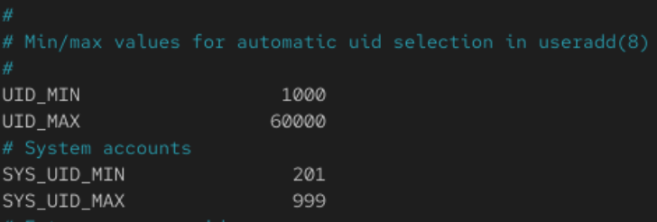
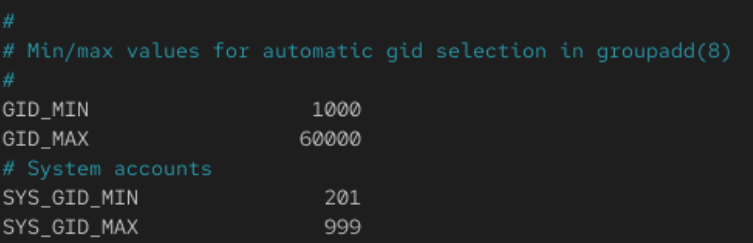
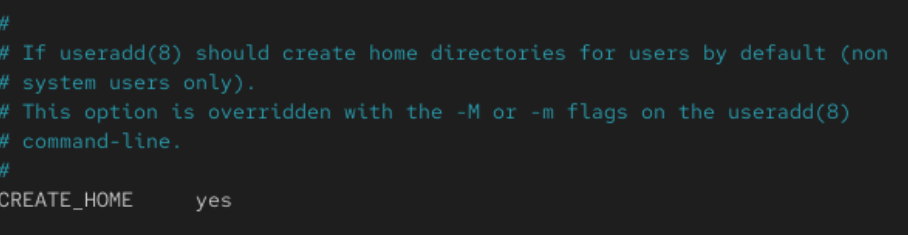

To change the default settings, you will need to change it in the

    /etc/logins.defs

>Password Aging

>User ID(UID) range to start with

>Group ID(GID) range to start with

>To specify if a home directory needs to be created when there is a new user

>To set the default Umask for permissions

