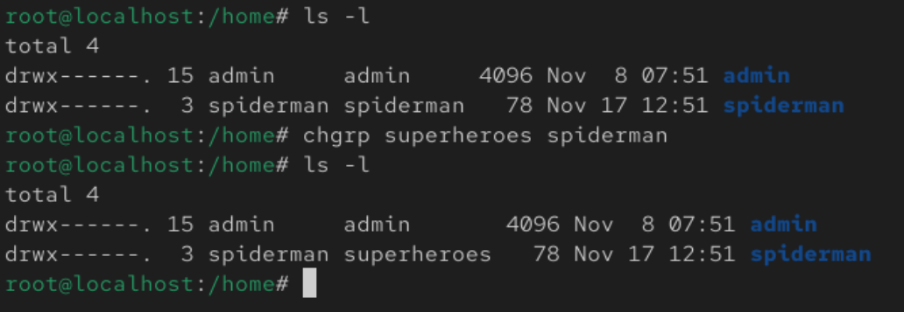
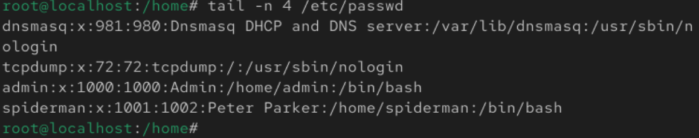

Commands to Manage

    - Users: useradd, userdel, usermod
    - Groups: groupadd, groupdel

When a new user is created, their account is managed by 3 different files

    - /etc/passwd
    - /etc/group
    - /etc/shadow

Example of creating a new user

     useradd -g superheroes -s /bin/bash -c "Peter Parker" -m -d /home/spiderman spiderman

| Command               | Description                                                                                |
| :-------------------- | ------------------------------------------------------------------------------------------ |
| useradd               | command to add user in linux                                                               |
| -g superheroes        | Set the primary group for user to be [superheroes], no group with Name of user is created. |
| -s /bin/bash          | Set the default user login shell to bash`                                                  |
| -c "Peter Parker" | Set a description for the user account                                                     |
| -m -d /home/spiderman | Create a home directory name spiderman and set it to /home/spiderman                       |
| spiderman             | Name of the user to be added                                                               |

&nbsp;

To check if the user is created, use id command:

     id [username]

&nbsp;

To check if the group is created, cat the group file in /etc/group

    cat /etc/group

&nbsp;

To change the primary group of the user, use chgrp

    chgrp -R [new primary group] [username] 
    *-R (recursive) is to cascade the group change to all the files and folders inside the folder.

>

&nbsp;

In /etc/group, `superheroes:x:1001:spiderman` as example
>

| Name        | Description                                     |
| :---------- | ----------------------------------------------- |
| superheroes | Group name                                      |
| x           | Encrypted password of the group displays as x   |
| 1001        | Linux Group ID                                  |
| spiderman   | Which user have this group as a secondary group |

&nbsp;

Whenever a new user is created, a new line to indicate the user will be added to /etc/passwd
>

Using `spiderman:x:1001:1002:Peter Parker:/home/spiderman:/bin/bash` as example

| Name            | Description                                      |
| :-------------- | ------------------------------------------------ |
| spiderman       | Name of the user account                         |
| x               | Encrypted password of the account displays as x  |
| 1001            | Linux User ID                                    |
| 1002            | Linux Group ID, refers to group name `spiderman` |
| Peter Parker    | Description of the user account                  |
| /home/spiderman | Home directory for the user                      |
| /bin/bash       | Shell login for the user                         |

&nbsp;

/etc/shadow is strictly for passwords of users we create.
>

`spiderman:!:20409:0:99999:7:[A]:[B]:[C]` as example
| Name      | Description                                                          |
| :-------- | -------------------------------------------------------------------- |
| spiderman | Name of the account                                                  |
| !         | Encrypted password shown as !                                        |
| 20409     | Number of days since 01/01/1970 that the password was changed        |
| 0         | Minimum number of days before a password change is needed            |
| 9999      | Maximum number of days before a password change is needed            |
| 7         | Number of days before a reminder is sent to user for password change |
| [A]       | Number of days after password expired or disabled                    |
| [B]       | Date when account is expired, express as days after 01/01/1970       |
| [C]       | Flag reserved for future                                             |

&nbsp;

