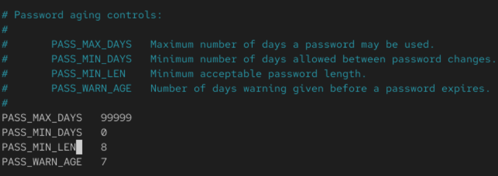

<strong>Password management</strong>

After creating a new user account, do remember to create a password for that user account as well by:

    passwd [username]

&nbsp;

>To set a password expiry period:

Use the chage command to set it
E.g. To manually change <strong>`each user`</strong>

    chage [-m mindays] [-M Maxdays] [-d lastday] [-I inactive] [-E expiredate] [-W warndays] user

| Name   | Description                                                                                                                  |
| :----- | ---------------------------------------------------------------------------------------------------------------------------- |
| chage  | Linux command                                                                                                                |
| -m [n] | Number of days required between password changes    Number of days left before user is allowed to change his/her password |
| -M [n] | Maximum number of days the password is valid   `*After user has changed his password`                                     |
| -W [n] | Number of days before user is reminded that his password needs to be changed                                                 |
| -I [n] | Number of days after the password expired and disable the account                                                            |
| -E [n] | Number of days since 01/01/1970 that account is disabled   Absolute date where the account cannot be used                 |

&nbsp;

To change the default settings for aging, you will need to change it in the

    /etc/logins.defs

